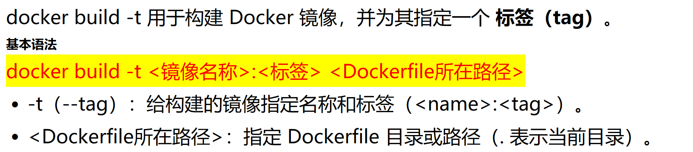
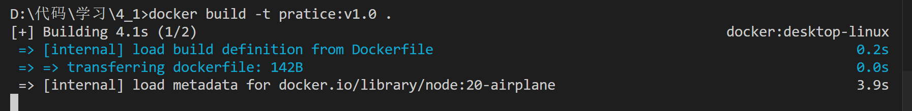
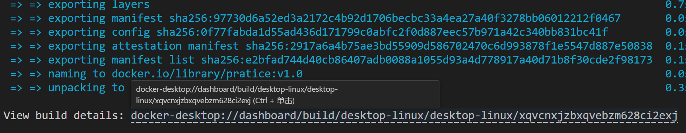

# Kubernetes 学习笔记

## 目录
1. [Git仓库初始化与配置](#git-仓库初始化与配置)
2. [Kubernetes Dashboard安装配置](#kubernetes-dashboard安装配置)
   - [安装Dashboard](#按照官方dashboard文档安装环境)
   - [配置ServiceAccount](#看kubectl--n-kubernetes-dashboard-get-serviceaccount有没有用户)
   - [创建访问Token](#然后创建admin-user-tokenyaml应用后生成密钥)
   - [访问Dashboard](#随后httpslocalhost8443输入token就能登录了)

## Git仓库初始化与配置

# git init
# git add .
# git commit -m "first commit"
# git checkout -b k8s
# git remote add origin git@github.com:lushiheng123/Docker-Study.git
# git push -u origin k8s

# `kubectl run test-pod --image=curlimages/curl --rm -it -- sh`创建测试node
# [按照官方dashboard文档安装环境](https://kubernetes.io/docs/tasks/access-application-cluster/web-ui-dashboard/)

```sh
# Add kubernetes-dashboard repository
helm repo add kubernetes-dashboard https://kubernetes.github.io/dashboard/
# Deploy a Helm Release named "kubernetes-dashboard" using the kubernetes-dashboard chart
helm upgrade --install kubernetes-dashboard kubernetes-dashboard/kubernetes-dashboard --create-namespace --namespace kubernetes-dashboar
```
# 看kubectl -n kubernetes-dashboard get serviceaccount有没有用户

# 没有的话，创建一个，记得kubectl apply -f 文件名
```sh
apiVersion: v1
kind: ServiceAccount
metadata:
  name: admin-user
  namespace: kubernetes-dashboard
---
apiVersion: rbac.authorization.k8s.io/v1
kind: ClusterRoleBinding
metadata:
  name: admin-user
roleRef:
  apiGroup: rbac.authorization.k8s.io
  kind: ClusterRole
  name: cluster-admin
subjects:
- kind: ServiceAccount
  name: admin-user
  namespace: kubernetes-dashboard

```
# 然后创建admin-user-token.yaml,应用后生成密钥
# kubectl -n kubernetes-dashboard get secret查看密钥
```yaml
apiVersion: v1
kind: Secret
metadata:
  name: admin-user-token
  namespace: kubernetes-dashboard
  annotations:
    kubernetes.io/service-account.name: admin-user
type: kubernetes.io/service-account-token
```

# kubectl -n kubernetes-dashboard port-forward svc/kubernetes-dashboard-kong-proxy 8443:443
# token输出： kubectl -n kubernetes-dashboard describe secret admin-user-token

```txt
eyJhbGciOiJSUzI1NiIsImtpZCI6ImI4d3hmajZ5WWdwR1Z2NG5RMmlHcVpXbE5hWkprR3BxdFo2eXY3MURoWEEifQ.eyJpc3MiOiJrdWJlcm5ldGVzL3NlcnZpY2VhY2NvdW50Iiwia3ViZXJuZXRlcy5pby9zZXJ2aWNlYWNjb3VudC9uYW1lc3BhY2UiOiJrdWJlcm5ldGVzLWRhc2hib2FyZCIsImt1YmVybmV0ZXMuaW8vc2VydmljZWFjY291bnQvc2VjcmV0Lm5hbWUiOiJhZG1pbi11c2VyLXRva2VuIiwia3ViZXJuZXRlcy5pby9zZXJ2aWNlYWNjb3VudC9zZXJ2aWNlLWFjY291bnQubmFtZSI6ImFkbWluLXVzZXIiLCJrdWJlcm5ldGVzLmlvL3NlcnZpY2VhY2NvdW50L3NlcnZpY2UtYWNjb3VudC51aWQiOiIzYjhiODA3OC01MTQ3LTRlMDktODI1MC01ZTFkMzVjZGIxNjMiLCJzdWIiOiJzeXN0ZW06c2VydmljZWFjY291bnQ6a3ViZXJuZXRlcy1kYXNoYm9hcmQ6YWRtaW4tdXNlciJ9.qXH3gxz0TcpV2Uhi0JJd0PjNh8irhOQBjyHv6kZAmAgAdIp8_XkQj6qy5lMeyga-dQFI6kGRXDwxGbuo6P9W_0pA3TecuPNuaivkc51_WZaWxLj5iqDoULTzzMan2x4tbcqyz3k95nLShZNssxmTNZf922Cm9jRi4aODiHilXRqZYzDF1mfS8O01CKX7TCIi2egpo1PK8p200wmHaCjQ-ojtdg40m9jBTc-mvrlzpPW9Bc6WGac6G4TYqeZA3av9Xtt8TubMv7BKVqwAlG3Of8Hz1P9bHs9yrdQhitfj5MgaFHzLOyQzAP5q0qC0D6UFpLPynCR3A-O1Q8RpMAfb9g
```

# 随后https://localhost:8443输入token就能登录了
