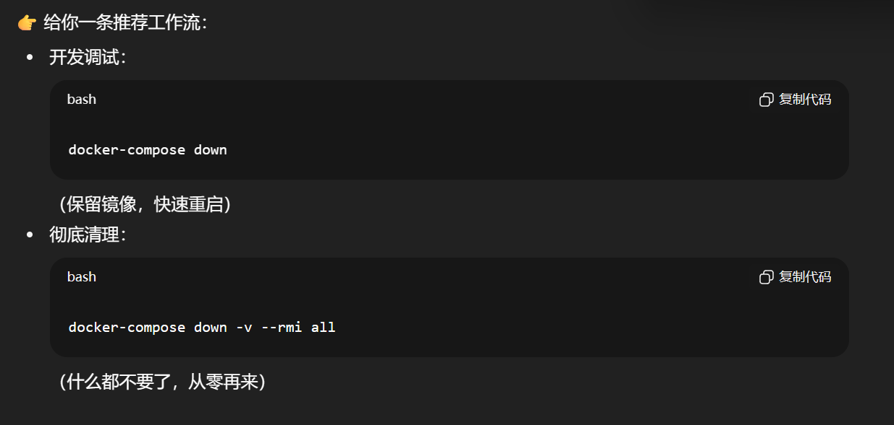

🐱‍💻 Access the course files on GitHub:https://github.com/lushiheng123/Docker-Study

```bash
echo "# Docker-Study" >> README.md
git init
git add README.md
git checkout -b docker_compose_1
git add .
git commit -m "docker_compose_1"
git branch -M main
git remote add origin git@github.com:lushiheng123/Docker-Study.git
git push -u origin docker_compose_1
```

# 先删除前面的容器和镜像（这样能删干净）

### 1. 写 docker-compose.yaml 文件

```yaml
version: "3.8"
services:
  api:
    build: ./api
    container_name: api_c
    ports:
      - "4000:4000"
    volumes:
      - ./api:/app
      - ./app/node_modules
```

### 2. 然后直接 docker-compose up


### 3. 查看 docker images 发现已经添加


### 4. docker run --name myapp_1 -p 4000:4000 -d 2024_7_9api_dockerfile-api:latest 可以运行

```cmd
docker run --name myapp_1 -p 4000:4000 -d 2024_7_9api_dockerfile-api:latest
```


