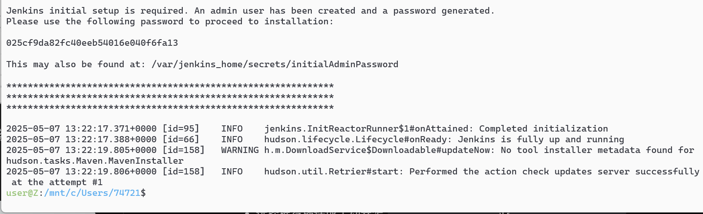

<h1 align = "center">写Dockerfile<h1>

```sh
git init
git add .
git checkout -b dockerfile
git add .
git commit -m "first commit"
git remote add origin git@github.com:lushiheng123/Docker-Study.git
git push -u origin dockerfile
```

# 1. 第一步，搞初始文件，主要是 Dockerfile 和 index 中后端端口一致

### Dockerfile

```dockerfile
FROM node:22-alpine
WORKDIR /app
COPY . .
RUN npm install
EXPOSE 4001
CMD ["node", "index.js"]
```

### index.js

```js
import express from "express";
import dotenv from "dotenv";

const app = express();
app.use(express.json());
dotenv.config();

const port = process.env.BACKEND_PORT || 4001;

app.listen(port, () => {
  console.log(`server is running on port ${port}`);
});

app.get("/", (req, res) => {
  res.send("你好");
});
```

# 2. 搞 `docker build`

```sh
docker build -t practice:v1.0 .
docker run -p 4001:4001 practice:v1.0
```


# 3.效果



