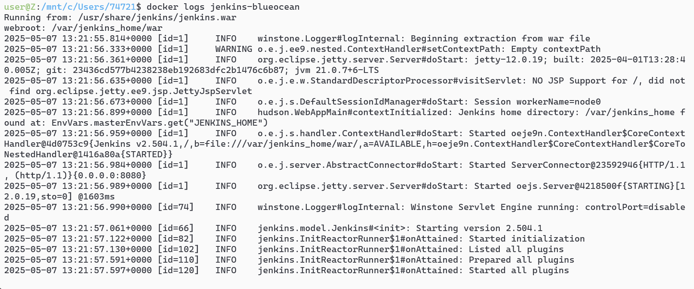

<h1 align = "center">Jenkins学习</h1>

```sh
git init
git add .

git commit -m "first commit"
git branch -M main
git checkout -b basic
git remote add origin git@github.com:lushiheng123/jenkins.git
git push -u origin basic
```

# 用 docker 安装

```sh
docker network create jenkins
docker network ls
```


## 安装镜像容器

```sh
docker run -d --name docker-dind --network jenkins --network-alias docker-dind \
  --privileged \
  -v docker-dind-data:/var/lib/docker \
  -e DOCKER_TLS_CERTDIR=/certs \
  docker:dind
```

```sh
docker run -d --name jenkins-blueocean --network jenkins \
  -p 8080:8080 -p 50000:50000 \
  -v jenkins_home:/var/jenkins_home \
  -e DOCKER_HOST=tcp://docker-dind:2376 \
  -e DOCKER_CERT_PATH=/certs/client \
  -e DOCKER_TLS_VERIFY=1 \
  --mount type=volume,source=docker-dind-data,destination=/certs/client,readonly \
  jenkins/jenkins:lts-jdk21
```

# 更改镜像源（自行 GPT)

# 安装 Docker 客户端和插件

```sh
docker exec -u root jenkins-blueocean bash -c "apt-get update && apt-get install -y docker.io && jenkins-plugin-cli --plugins 'blueocean docker-workflow json-path-api'"
```

# `docker ps`查看状态确认 jenkins-blueocean 和 docker-dind 都在运行，且 jenkins-blueocean 有 0.0.0.0:8080->8080/tcp 的端口映射。


# docker logs jenkins-blueocean 查看日志找到初始密码




# 浏览器复制进去 localhost:8080


# 安装推荐的插件


# 创建 item,job


# 选择最流行的执行 shell 和 e-mail 的提示


# 尝试导出`build_id和build_url`这种环境变量参数


