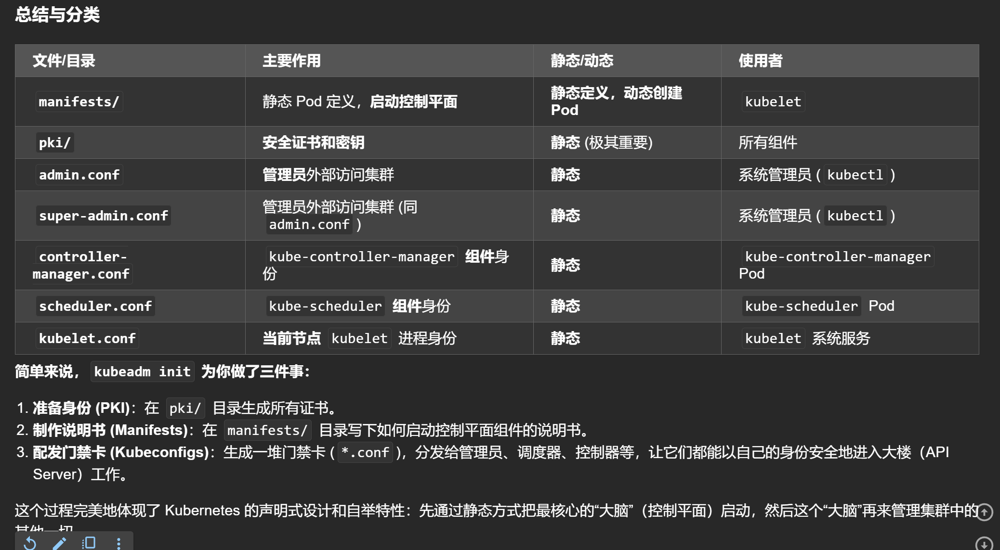

# 这里指的目录结构是指的当kubeadm init后，自动创建的配置文件
```yaml
kubeadm init --kubernetes-version=1.33.3 --pod-network-cidr 192.168.0.0/16 --ignore-preflight-errors=NumCPU --ignore-preflight-errors=Mem
```


# *conf文件

# 总结
