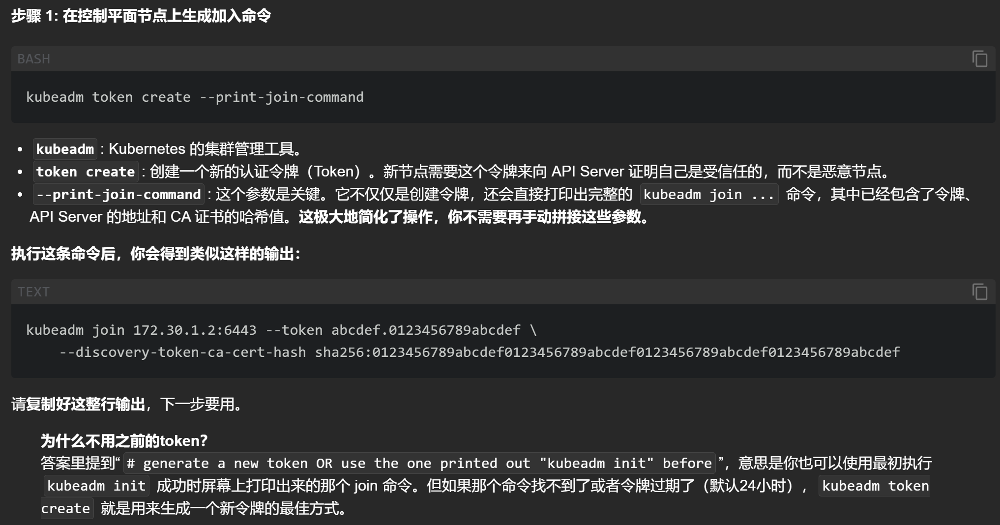
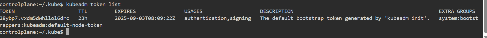
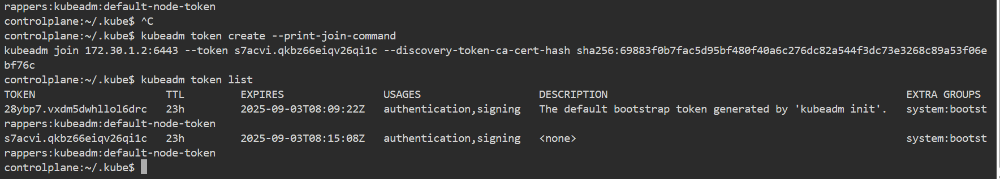
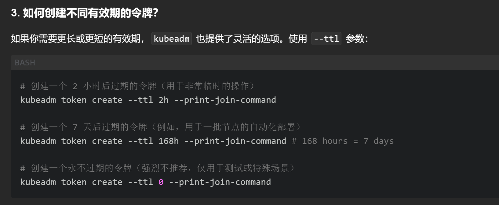

# kubeadm token create --print-join-command

```sh
kubeadm join 172.30.1.2:6443 --token s7acvi.qkbz66eiqv26qi1c --discovery-token-ca-cert-hash sha256:69883f0b7fac5d95bf480f40a6c276dc82a544f3dc73e3268c89a53f06ebf76c 
```
# 看当前toke:`kubeadm token list`

# 生成的都是24小时的，可以想办法改变过期时间



# 去节点去加入`kubeadm join 172.30.1.2:6443 --token s7acvi.qkbz66eiqv26qi1c --discovery-token-ca-cert-hash sha256:69883f0b7fac5d95bf480f40a6c276dc82a544f3dc73e3268c89a53f06ebf76c`
`
