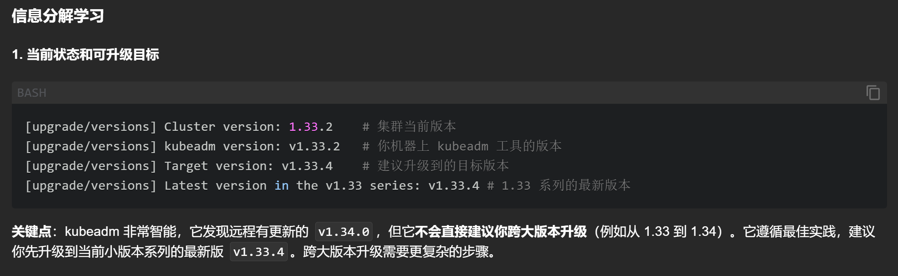
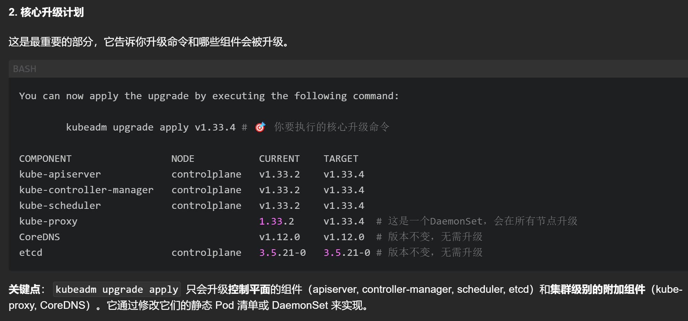
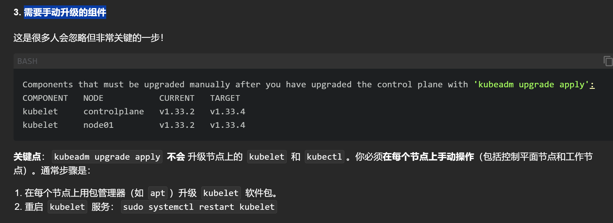
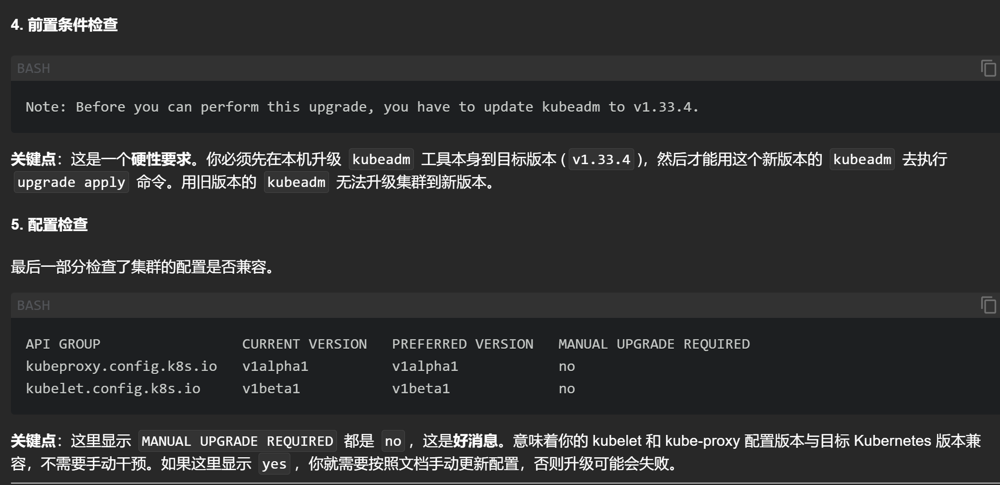
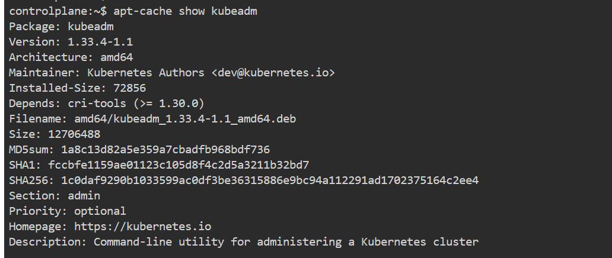

# `kubeadm upgrade plan`包含了升级一个 Kubernetes 集群所需的所有关键信息
## 1-当前版本

## 2-核心升级计划

## 3-需要手动升级的组件

## 4- 前置条件检查

# 这里我们通常要先升级下control节点的kubeamd工具`apt-cache show kubeadm`

## 更新命令:`apt upgrade kubeadm`
# 然后`kubeadm upgrade apply v1.33.4`执行更新

# 然后更新kubectl 和kubelet工具`apt install kubelet=1.33.4-1.1 kubectl=1.33.4-1.1`