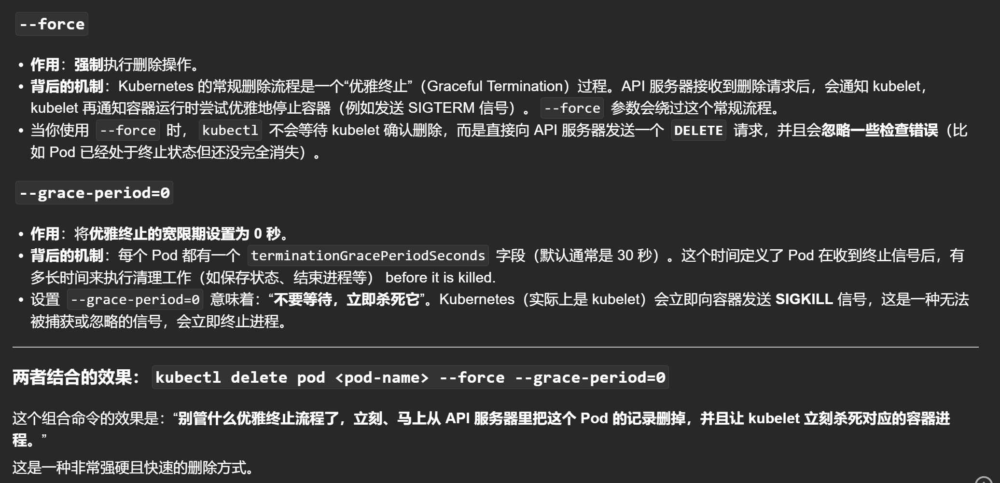

# 1-强制删除--force --grace-period=0



看到你的输出，我来帮你清空所有资源。通常的做法是**按层次结构从外到内删除**，或者使用更高效的方法。

## **方法1：推荐做法 - 删除命名空间内所有资源（最彻底）**

```bash
# 删除当前命名空间下的所有资源（但保留命名空间本身）
kubectl delete all --all

# 或者指定命名空间（如果你不在 default 命名空间）
kubectl delete all --all -n <namespace-name>
```

**这个命令会删除：**
- 所有 Pods
- 所有 Services
- 所有 Deployments
- 所有 ReplicaSets
- 所有其他资源（除了 PersistentVolume 等持久化资源）

## **方法2：选择性删除特定资源**

```bash
# 删除 Deployment（会自动删除对应的 ReplicaSet 和 Pods）
kubectl delete deployment nginx-deployment

# 删除独立的 ReplicaSet（你之前手动创建的）
kubectl delete replicaset nginx-replicaset

# 删除独立的 Pods（非控制器管理的）
kubectl delete pod myapp-pod nginx

# 删除 Service（如果需要）
kubectl delete service <service-name>
```

## **方法3：按资源类型批量删除**

```bash
# 删除所有 Deployments
kubectl delete deployment --all

# 删除所有 ReplicaSets  
kubectl delete replicaset --all

# 删除所有 Pods
kubectl delete pod --all

# 删除所有 Services
kubectl delete service --all
```

## **针对你的具体情况操作**

根据你的输出，建议这样操作：

```bash
# 方法1：最简单彻底（推荐）
kubectl delete all --all

# 方法2：分步操作（如果你想保留某些资源）
kubectl delete deployment nginx-deployment      # 删除 Deployment（会连带删除它的 ReplicaSet 和 Pods）
kubectl delete replicaset nginx-replicaset      # 删除独立的 ReplicaSet（会连带删除它的 Pods）
kubectl delete pod myapp-pod nginx              # 删除独立的 Pods
```

## **验证删除结果**

```bash
# 删除后验证
kubectl get all

# 应该看到类似这样的输出：
No resources found in default namespace.
# 或者只有一些系统资源
```

## **重要注意事项**

### **1. 持久化资源不会被删除**
```bash
# 这些不会被 `kubectl delete all --all` 删除：
kubectl get pv,pvc,configmap,secret,namespace
```

### **2. 如果你想完全清空（包括持久化数据）**
```bash
# 删除 PVC（持久化存储声明）
kubectl delete pvc --all

# 删除 ConfigMaps 和 Secrets
kubectl delete configmap --all
kubectl delete secret --all
```

### **3. 最彻底的清理（删除整个命名空间）**
```bash
# 删除整个命名空间（会删除里面的所有资源）
kubectl delete namespace default

# 然后重新创建
kubectl create namespace default
```

## **推荐的操作步骤**

```bash
# 1. 先查看当前所有资源
kubectl get all

# 2. 使用推荐方法删除
kubectl delete all --all

# 3. 验证是否清理干净
kubectl get all

# 4. 检查是否有残留的持久化资源
kubectl get pvc,configmap,secret
```

## **总结**

对于你的情况，**最简单的做法是：**

```bash
kubectl delete all --all
```

这个命令会：
- ✅ 删除 `nginx-deployment` Deployment
- ✅ 删除对应的 ReplicaSet `nginx-deployment-56788599d7`
- ✅ 删除对应的 3 个 Pods
- ✅ 删除独立的 `nginx-replicaset` ReplicaSet
- ✅ 删除对应的 5 个 Pods
- ✅ 删除独立的 Pods `myapp-pod` 和 `nginx`
- ✅ 删除所有 Services

执行后你的环境就会完全清空了！