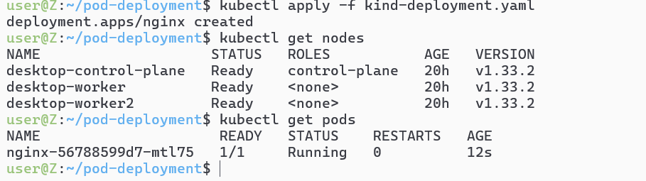

# 1-基本用法（主要是结合deployment用的）

# 2-初始环境配置

```yaml

apiVersion: v1
kind: Pod
metadata:
  name: backend-pod
  labes: 
    app: tiny-backend
spec:
  containers:
  - image: express-backend1:latest
    name: express-backend1
    ports:
    - containerPort: 3000
```

# 3-用expose的指令为现有pod创建service
```sh
kubectl expose pod backend-pod --name=backend-service --port=3000 --target-port=3000
```

## `kubectl run test-pod --image=curlimages/curl --rm -it -- sh`建测试环境
### curl http://backend-service:3000有响应


# 4-但是基本上还是跟着deploy模式走的，后续加service的操作比较少见

```yaml
apiVersion: apps/v1
kind: Deployment
metadata:
  name: nginx
spec:
  replicas: 1
  selector:
    matchLabels:
      app: nginx
  template:
    metadata:
      labels:
        app: nginx
    spec:
      containers:
      - name: nginx
        image: nginx:stable-alpine3.21-perl
        ports:
        - containerPort: 80
```

## `kubectl apply -f kind-deployment.yaml`
## `kubectl expose deploy nginx --name=nginx --port=3000 --target-port=80`
## `kubectl run test-pod --image=curlimages/curl --rm -it -- sh`测试
