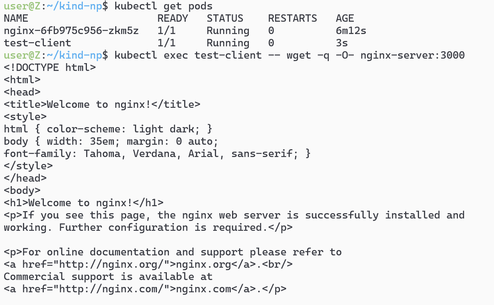

# 1.创建测试pod 
```sh
 kubectl run test-client --image=nginx:stable-alpine3.21-perl --labels="app=test-client"
```

# 2-测试`kubectl exec test-client -- wget -q -O- nginx-server:3000`
## 就像是docker exec -it一样
