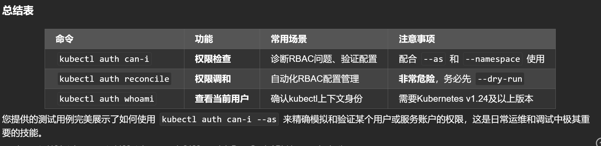
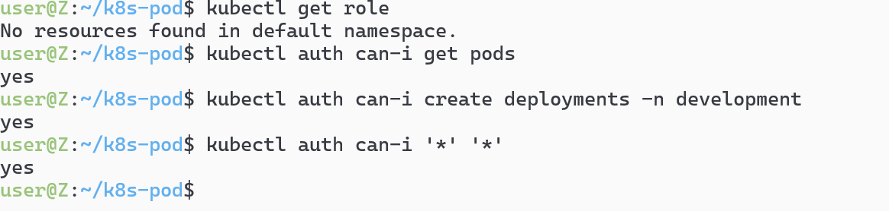
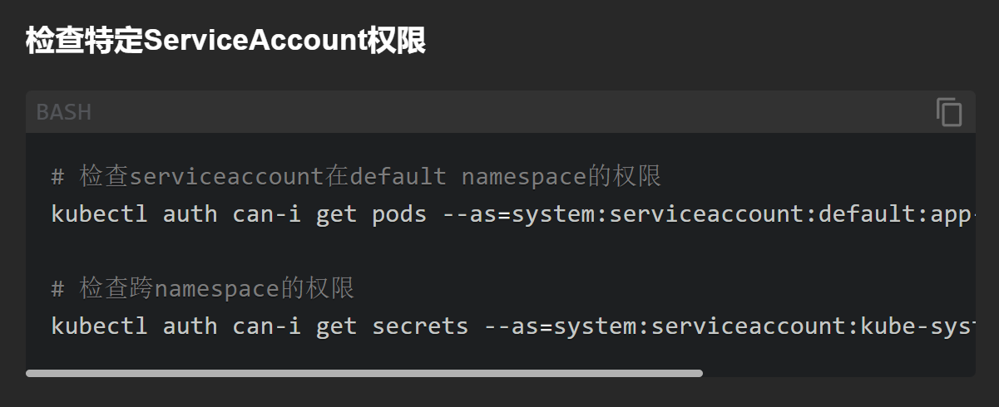
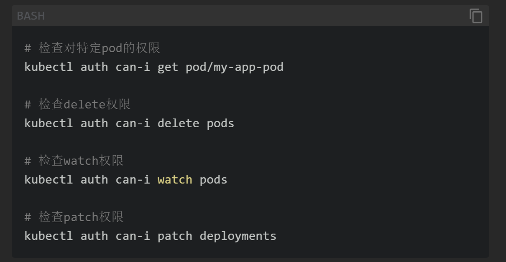

# 实际上就是看权限够不够



# 例子

## 检查当前用户权限
```sh
kubectl auth can-i get pods
kubectl auth can-i create deployments -n development
kubectl auth can-i '*' '*'
```




## 检查特定ServiceAccount权限


## 检查具体资源的操作权限
