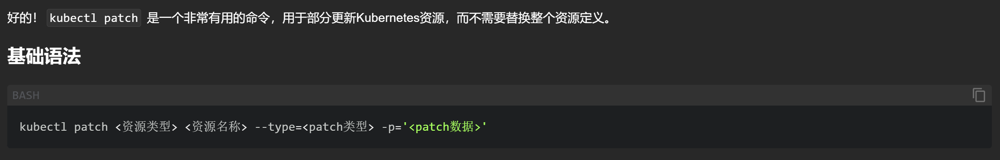
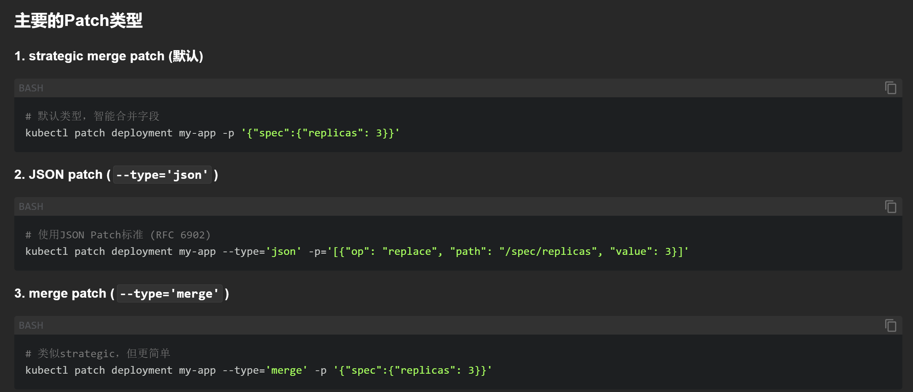
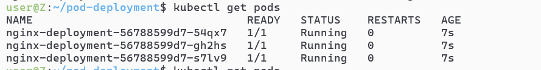
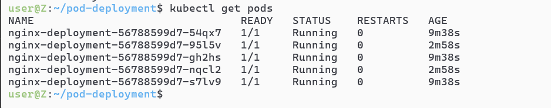

# `kubectl patch` 更新资源


# 主要的`patch`类型



# 实验场景
## kind=Deployment的yaml清单文件
```yaml
apiVersion: apps/v1
kind: Deployment
metadata:
  name: nginx-deployment
spec:
  replicas: 3
  selector:
    matchLabels:
      app: nginx
  template:
    metadata:
      labels:
        app: nginx
    spec:
      containers:
      - name: nginx
        image: nginx:stable-alpine3.21-perl
        ports:
        - containerPort: 80
```

## apply -f后的只有3个pod里面跑了nginx容器


## 随后我们尝试kubectl patch的方式扩容，指令如下
```sh
kubectl patch deployment nginx-deployment -p '{"spec":{"replicas":5}}'
```

## 检验我们的成果`kubectl get pods`
