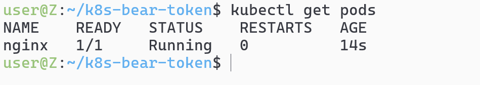
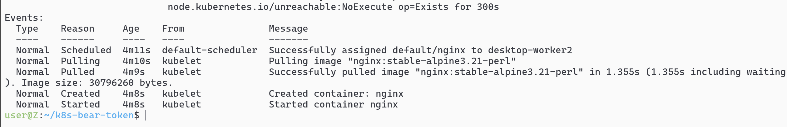
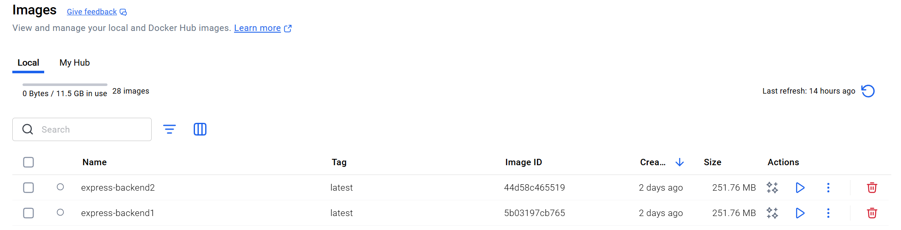
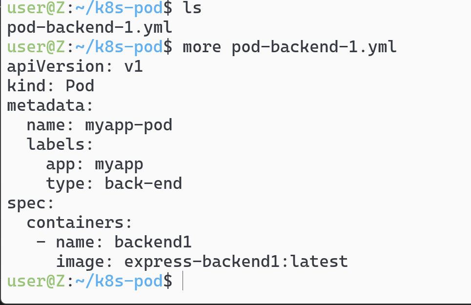
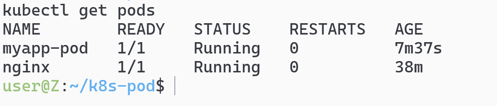
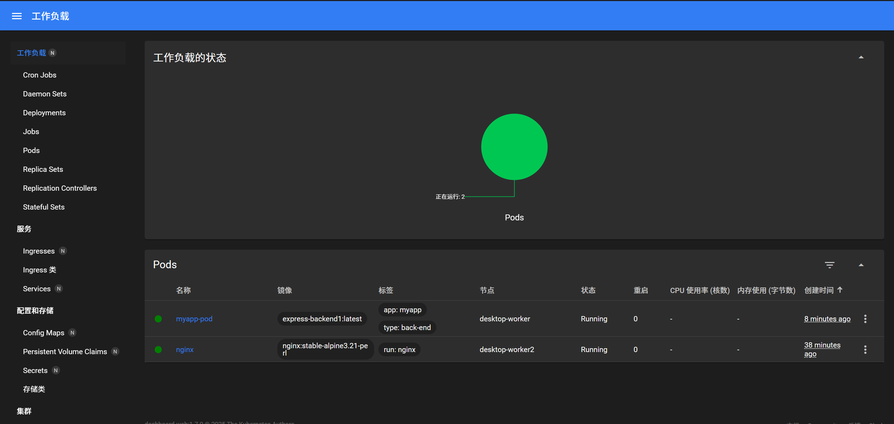
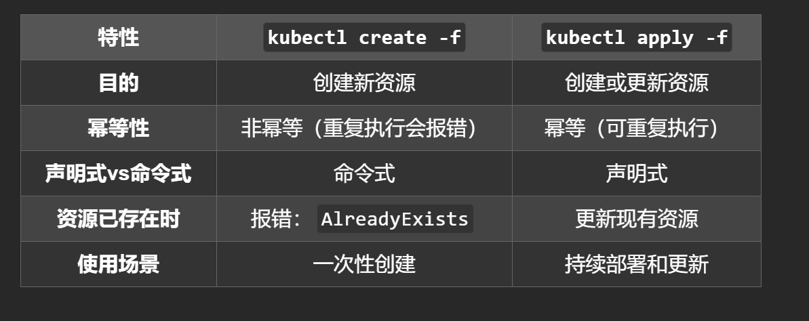
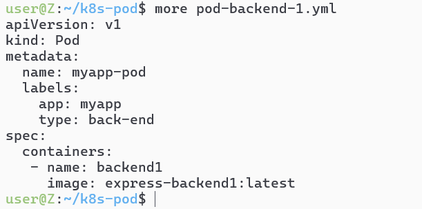
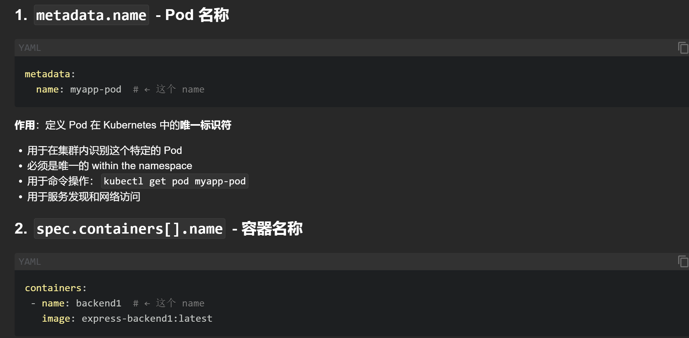
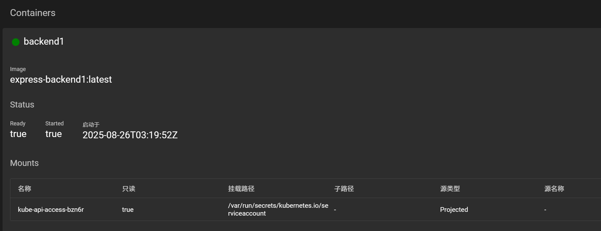

<h1 align="center">此章针对pod</h1>

# `kubectl run nginx --image=nginx:stable-alpine3.21-perl`实际上就等同于kubectl run nginx --image=docker.io/library/nginx:stable-alpine3.21-perl
## 当我们需要指定的时候
## kubectl run my-app --image=myregistry.example.com/my-app:1.0，直接去指定就行了
# kubectl get pods 查看(如果没起来就用describe去看是不是镜像版本写错了)

# kubectl describe pod <pod-name>能看到具体信息（主要是看events判断拉取的过程）

## 启用kubectl dashboard来实现可视化web-ui


# 拉取一个后端的backend镜像，之前写的

## 1-写yml文件

```yml
apiVersion: v1
kind: Pod
metadata:
  name: myapp-pod
  labels:
    app: myapp
    type: back-end
spec:
  containers:
   - name: backend1
     image: express-backend1:latest
```
## 2-`kubectl create -f pod-backend-1.yml`创建pod
### 观察pod情况



## 3-kubectl create 和apply文件创建pod的区别？


## 4-yml文件分为pod的名字，和Pod下面包含容器的名字


