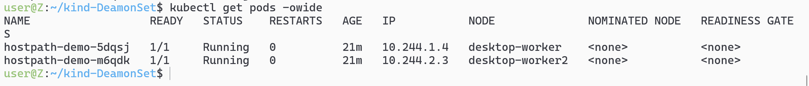

# 这个kind的作用


# 实验环境
```yaml
apiVersion: apps/v1
kind: DaemonSet
metadata:
  name: hostpath-demo
  namespace: default # 放到默认命名空间，方便操作
spec:
  selector:
    matchLabels:
      app: hostpath-demo
  template:
    metadata:
      labels:
        app: hostpath-demo
    spec:
      containers:
      - name: demo-container
        image: nginx:stable-alpine3.21-perl # 一个更小的Linux镜像
        command:
          - sh
          - -c
          - |
            echo "Hello from Pod $(hostname) on Node $(NODE_NAME)!" > /app-node-dir/greeting.txt
            echo "File written successfully. Going to sleep..."
            sleep 3600 # 睡眠1小时，给我们足够的时间检查
        env:
          - name: NODE_NAME
            valueFrom:
              fieldRef:
                fieldPath: spec.nodeName # 将Pod所在的Node名注入环境变量
        volumeMounts:
        - name: host-volume
          mountPath: /app-node-dir # 容器内的挂载点
      volumes:
      - name: host-volume
        hostPath:
          path: /tmp/hostpath-demo # ⚠️ Node上的路径！我们故意选/tmp，因为所有节点都有且可写。
          type: DirectoryOrCreate # 如果路径不存在，则自动创建下
```
## 它默认会在worker中创建，而不在controller节点上


