# 大致作用，是作为入口网关使的
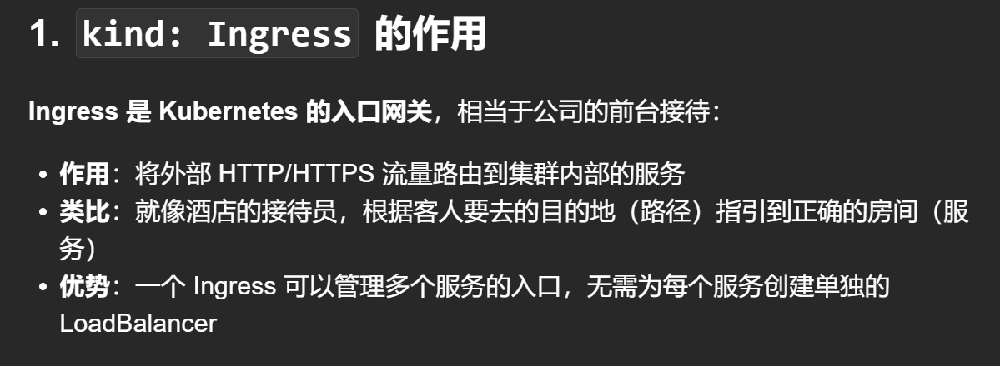


# 1- 实验环境
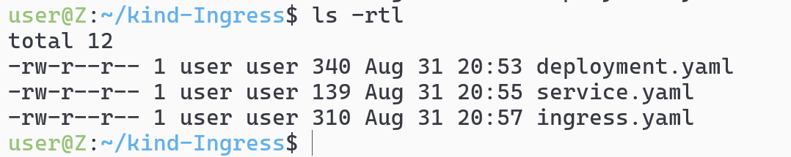
## 先创建namespace为ingress-nginx
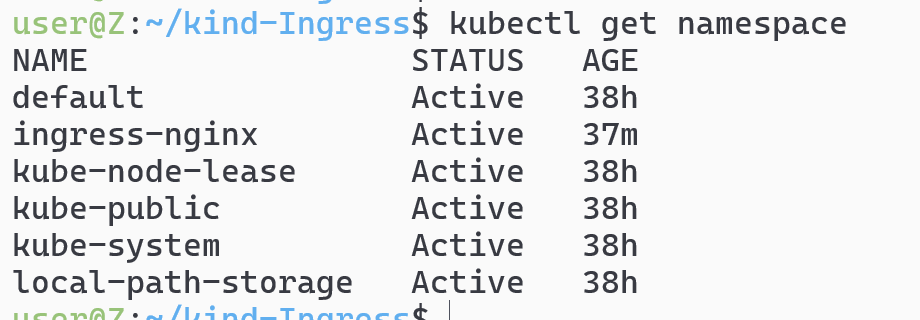
## 随后部署ingree-nginx的controller
```sh
helm upgrade --install ingress-nginx ingress-nginx \
  --repo https://kubernetes.github.io/ingress-nginx \
  --namespace ingress-nginx --create-namespace
```
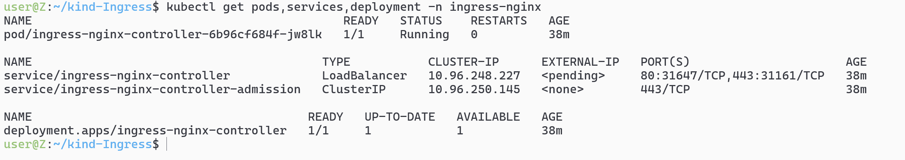

## 随后在default上部署咱的nginx服务
## deploymnet.yaml
```yaml
apiVersion: apps/v1
kind: Deployment
metadata:
  name: nginx
  namespace: default
spec:
  replicas: 1
  selector:
    matchLabels:
      app: nginx-test
  template:
    metadata:
      labels:
        app: nginx-test
    spec:
      containers:
        - name: nginx
          image: nginx:stable-alpine3.21-perl
          ports:
          - containerPort: 80
```

## services.yaml
```yaml
apiVersion: v1
kind: Service
metadata:
  name: nginx-server
  namespace: default
spec:
  selector:
    app: nginx-test
  ports:
    - protocol: TCP
      port: 3000
      targetPort: 80
  type: ClusterIP
```


## ingress.yaml
```yaml
apiVersion: networking.k8s.io/v1
kind: Ingress
metadata:
  name: simple-ingress
  namespace: default
  annotations:
    # this annotation removes the need for a trailing slash when calling urls
    # but it is not necessary for solving this scenario
    nginx.ingress.kubernetes.io/rewrite-target: /
spec:
  ingressClassName: nginx
  rules:
    - http:
        paths:
        - path: /
          pathType: Prefix
          backend:
            service:
              name: nginx-server
              port:
                number: 3000
```

# `kubectl apply -f deployment.yaml`
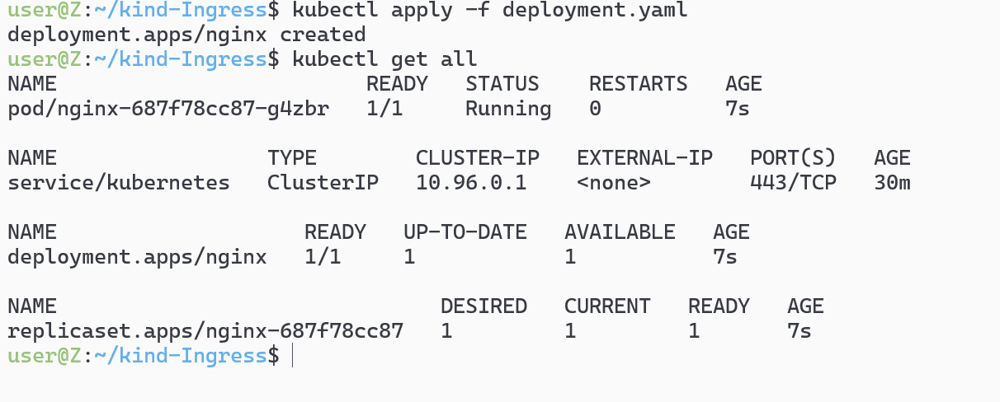
# `kubectl apply -f service.yaml`
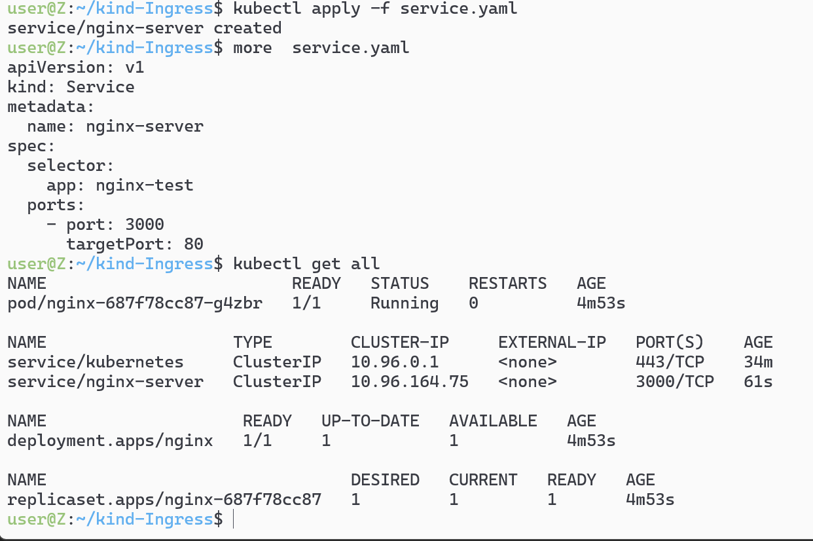
# `kubectl apply -f ingress.yaml`
## `kubectl get ingress`
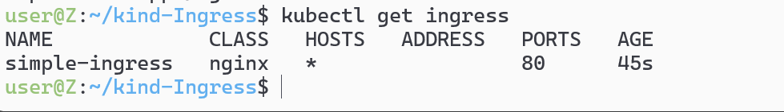

# `kubectl get service nginx-server  -o wide`
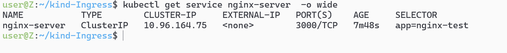


# 测试环境主要还是看service暴露的什么端口`kubectl get service`，这里是3000

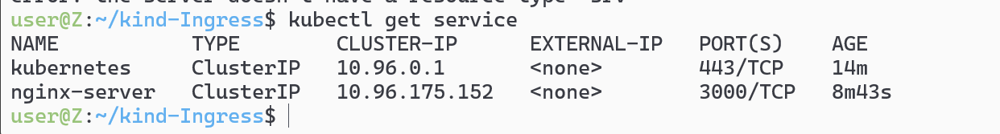

## 随后，我们`kubectl run test-pod --image=curlimages/curl --rm -it -- sh`创建一个测试的pod，`curl http://nginx-server:3000`出了结果,成功

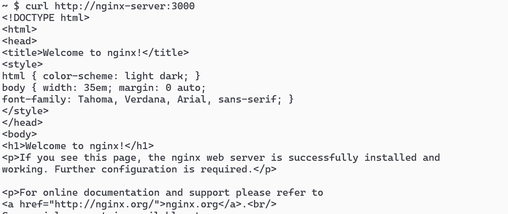


# 2-考试环境
## 配置
```yaml
apiVersion: networking.k8s.io/v1
kind: Ingress
metadata:
  name: world
  namespace: world
  annotations:
    # this annotation removes the need for a trailing slash when calling urls
    # but it is not necessary for solving this scenario
    nginx.ingress.kubernetes.io/rewrite-target: /
spec:
  ingressClassName: nginx # k get ingressclass
  rules:
  - host: "world.universe.mine"
    http:
      paths:
      - path: /europe
        pathType: Prefix
        backend:
          service:
            name: europe
            port:
              number: 80
      - path: /asia
        pathType: Prefix
        backend:
          service:
            name: asia
            port:
              number: 80
```


## 重定向`annotations`
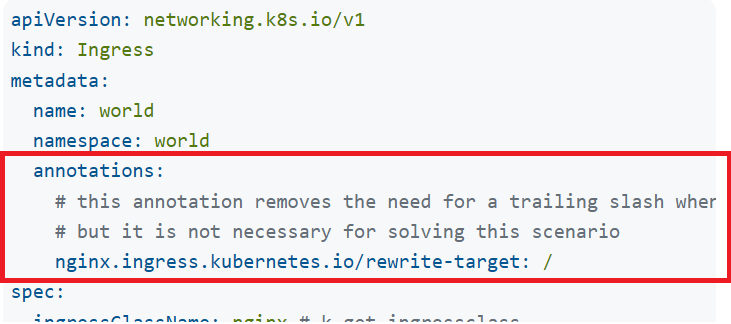
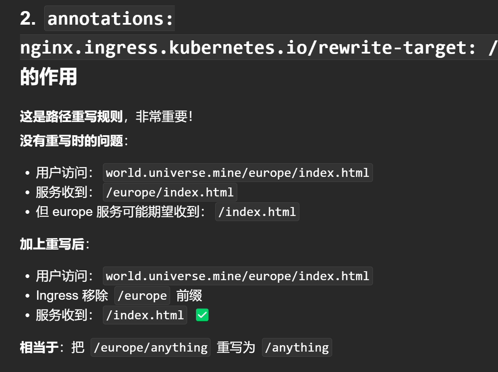
## `rules`路由规则集合
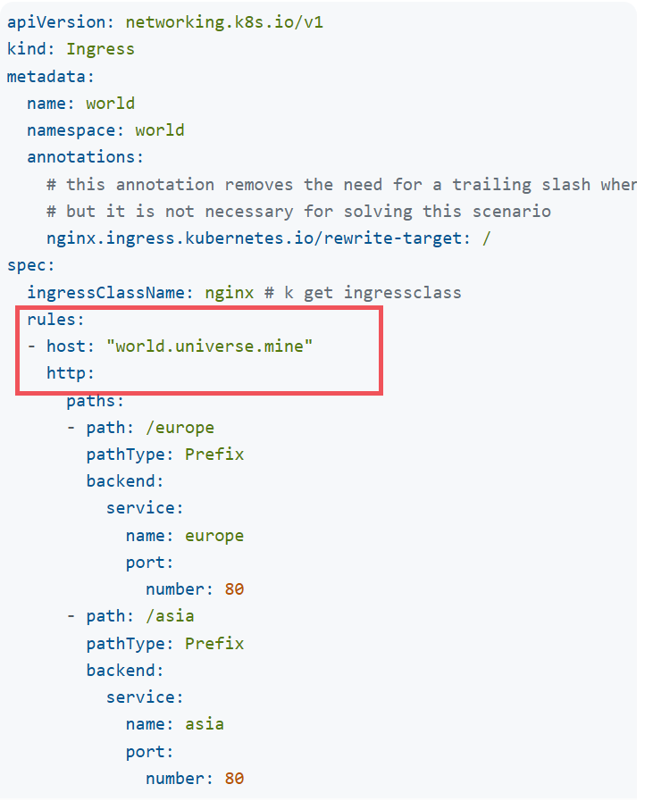
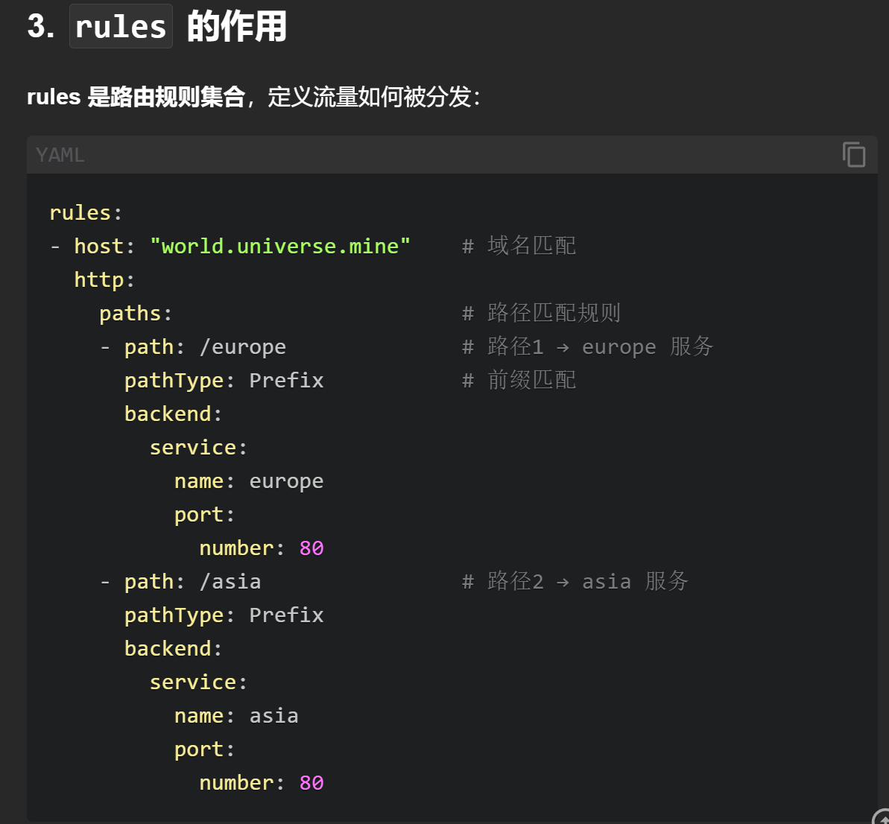
##  总体实现的效果
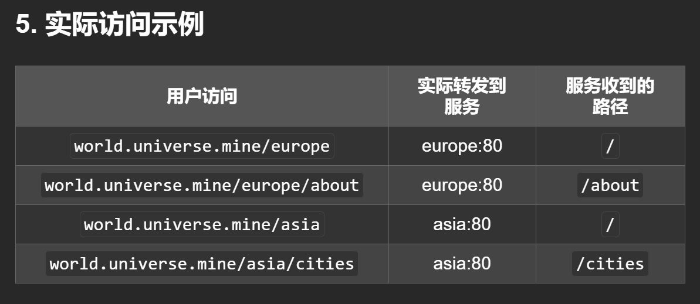