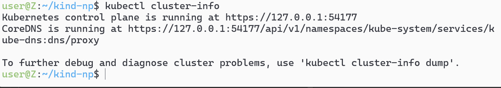
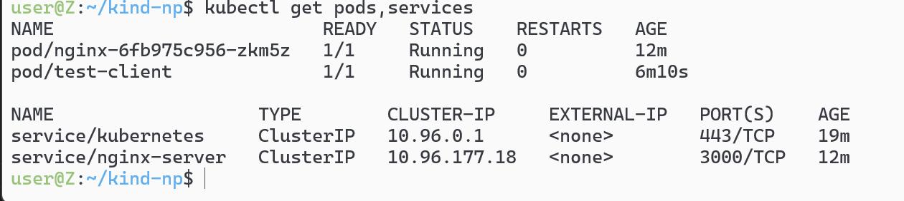

# kind集群环境暂时不支持

# 1-通过yaml文件和apply来创建`kind:NetworkPolicy`


# 2-实验环境搭建
## `deployment.yaml`
```yaml
apiVersion: apps/v1
kind: Deployment
metadata:
  name: nginx
  namespace: default
spec:
  replicas: 1
  selector:
    matchLabels:
      app: nginx-test
  template:
    metadata:
      labels:
        app: nginx-test
    spec:
      containers:
        - name: nginx
          image: nginx:stable-alpine3.21-perl
          ports:
          - containerPort: 80
```

## `service.yaml`
```sh
apiVersion: v1
kind: Service
metadata:
  name: nginx-server
  namespace: default
spec:
  selector:
    app: nginx-test
  ports:
    - protocol: TCP
      port: 3000
      targetPort: 80
  type: ClusterIP
```

## 创一个测试pod:`kubectl run test-client --image=nginx:stable-alpine3.21-perl --labels="app=test-client"`



## kubectl exec测试
## 测试`kubectl exec test-client -- wget -q -O- nginx-server:3000`
## 就像是docker exec -it一样


## 创一个`np-deny-all.yaml`全拒绝的策略

```yaml
apiVersion: networking.k8s.io/v1
kind: NetworkPolicy
metadata:
  name: deny-all-ingress
  namespace: default
spec:
  podSelector: {}  # 选择所有 Pod
  policyTypes:
  - Ingress
  ingress: []      # 空数组表示拒绝所有入站
```