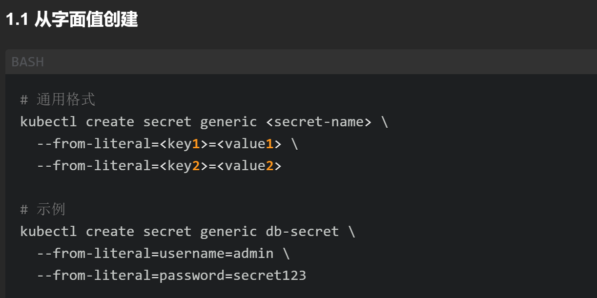
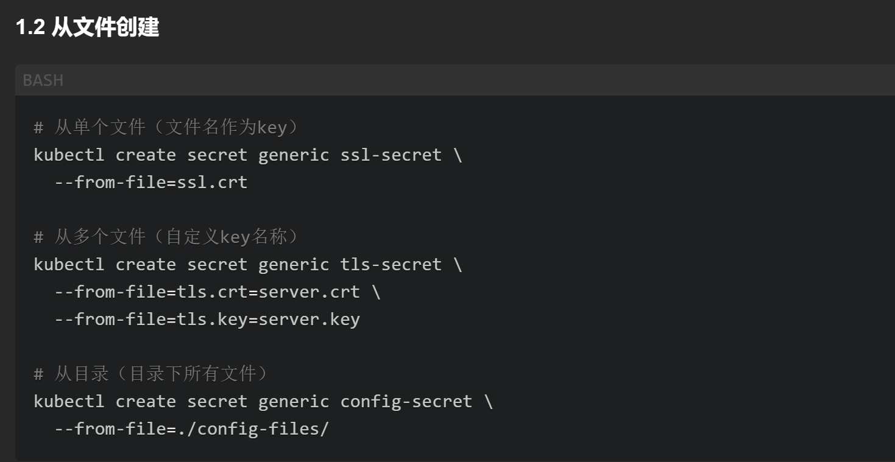
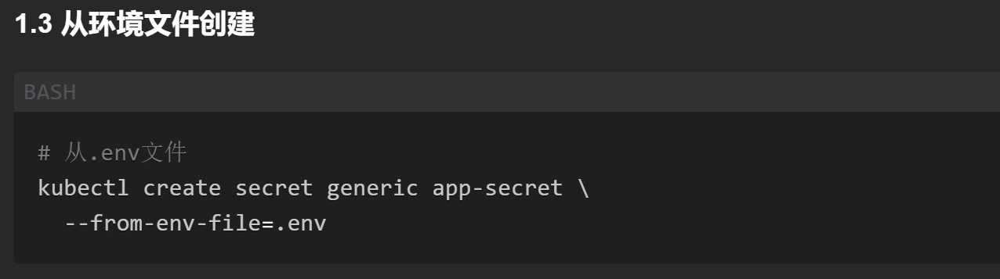
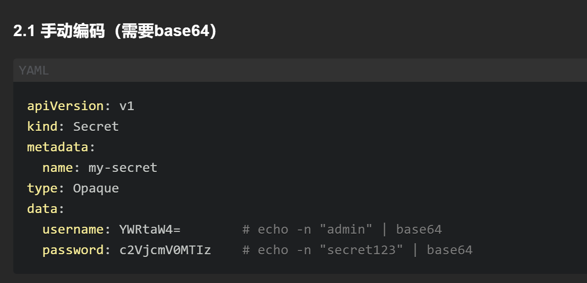
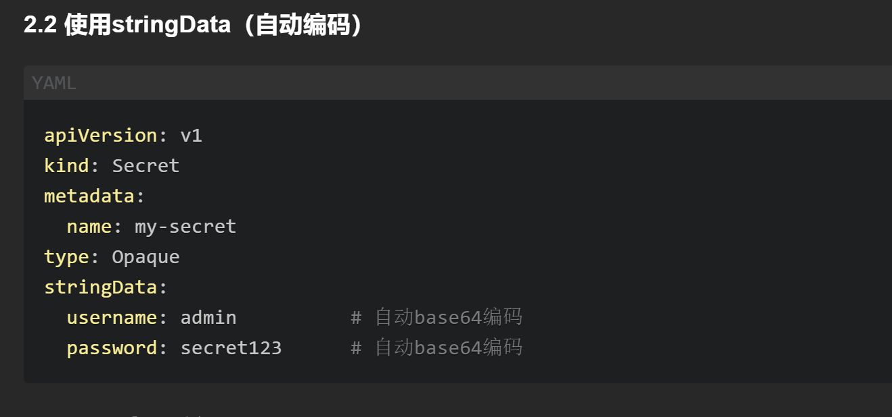
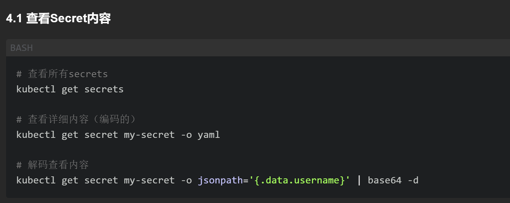
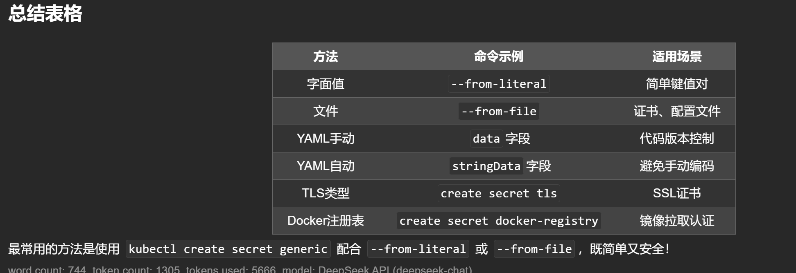
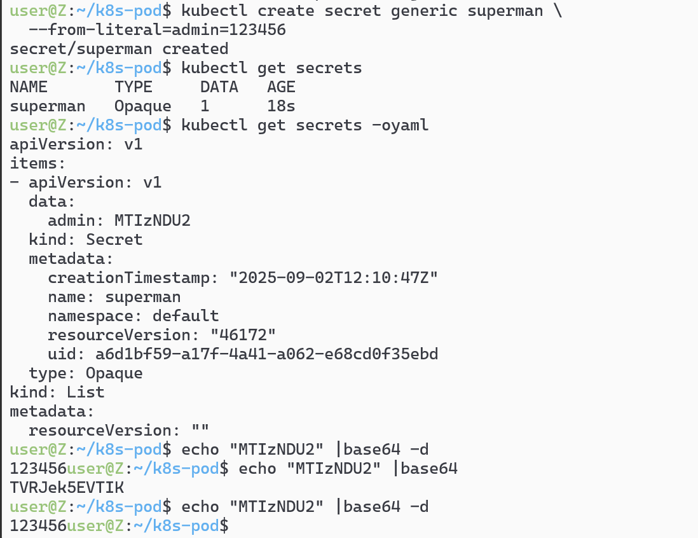

# 命令行创建密码secret 

## 从文件创建secret是常见的情况

```sh
kubectl create secret generic database-app-secret \
> --from-file=database-data.txt
```



# 通过清单文件创建



# 查看secret  `kubectl get secrets`





# 用base64可以解析密码（自己的环境）
