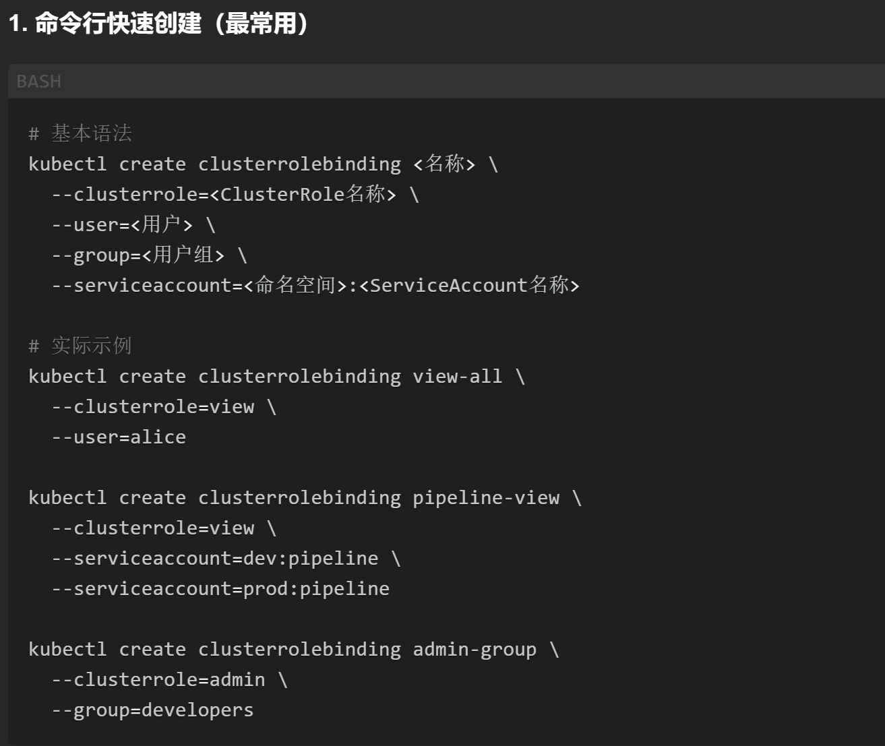
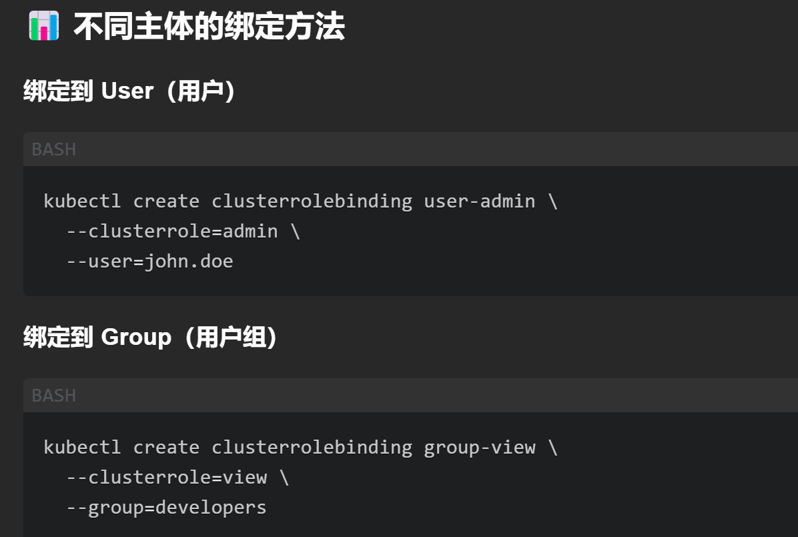
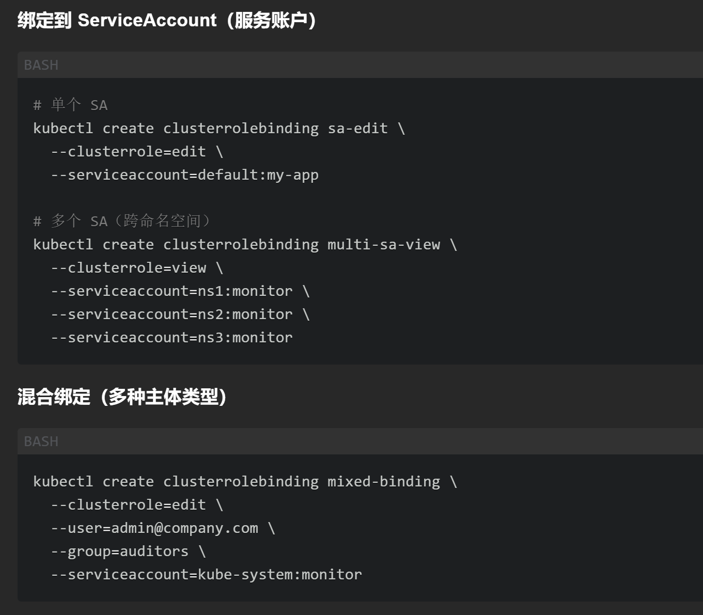

# 创建方法
## 1-命令行

## 2-yaml
```yaml
# clusterrolebinding.yaml
apiVersion: rbac.authorization.k8s.io/v1
kind: ClusterRoleBinding
metadata:
  name: pipeline-view
roleRef:
  apiGroup: rbac.authorization.k8s.io
  kind: ClusterRole
  name: view
subjects:
- kind: ServiceAccount
  name: pipeline
  namespace: dev
- kind: ServiceAccount
  name: pipeline
  namespace: prod
- kind: User
  name: bob@company.com
- kind: Group
  name: dev-ops
```

# 绑定用户

