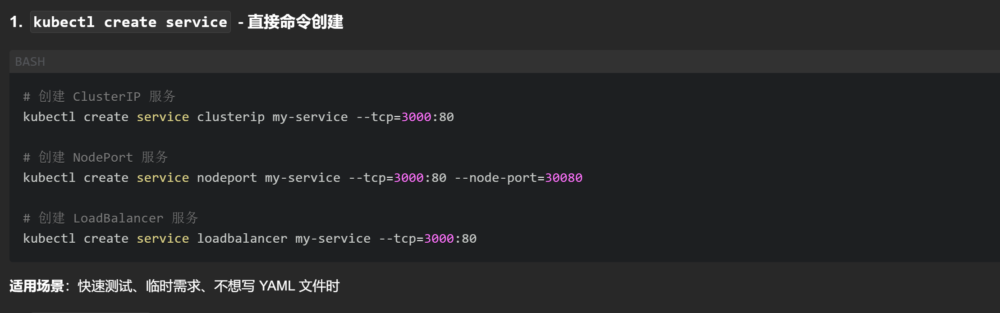
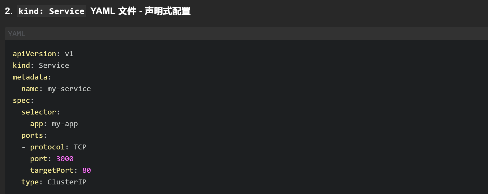
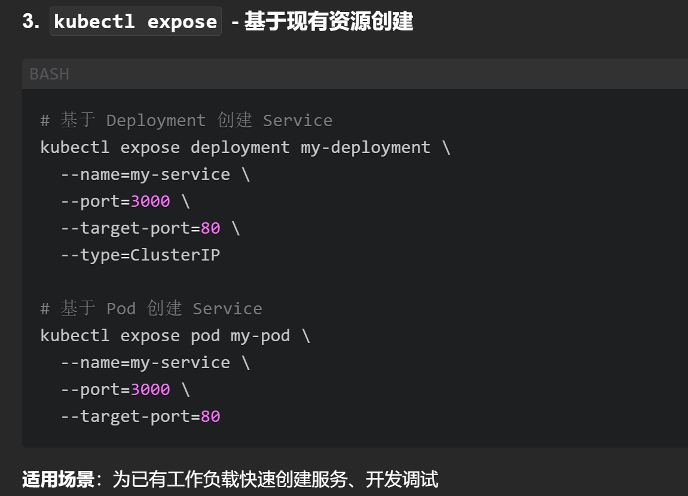
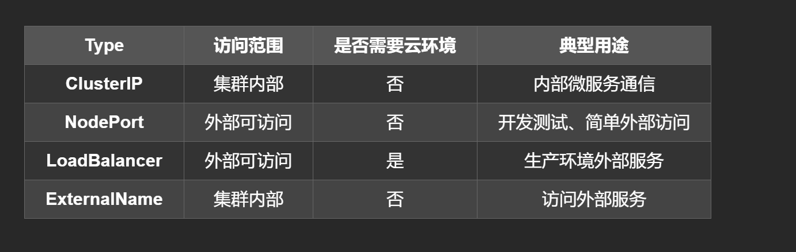
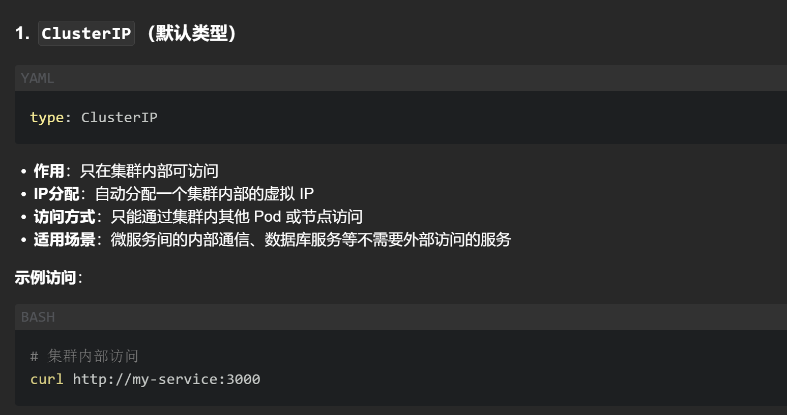
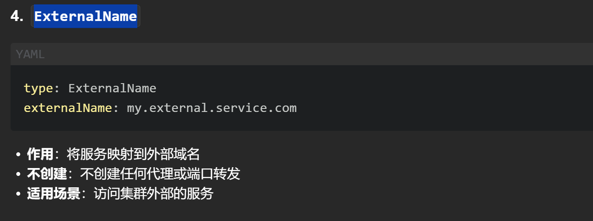

# Service是必须单独写的，属于kind的一种，不能和Deployment啥的写在一个yaml文件中
# 创建service也基本上有两种或者3种常见的方式

# 1-`kubectl create`的方式

# 2-YAML 文件 - 声明式配置

# 3-expose基于现有资源创建

# 有哪些type的类型

## clusterIP

## nodeport

## LoadBalancer

## ExternalName
