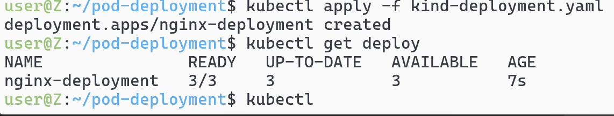
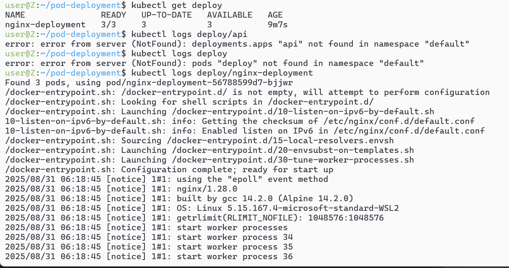
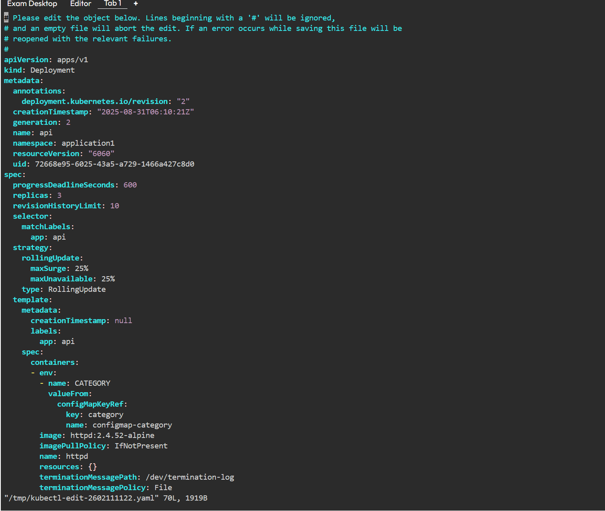
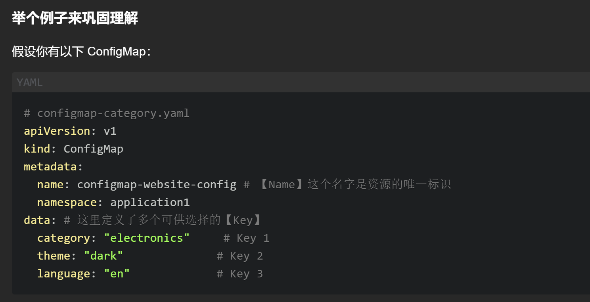
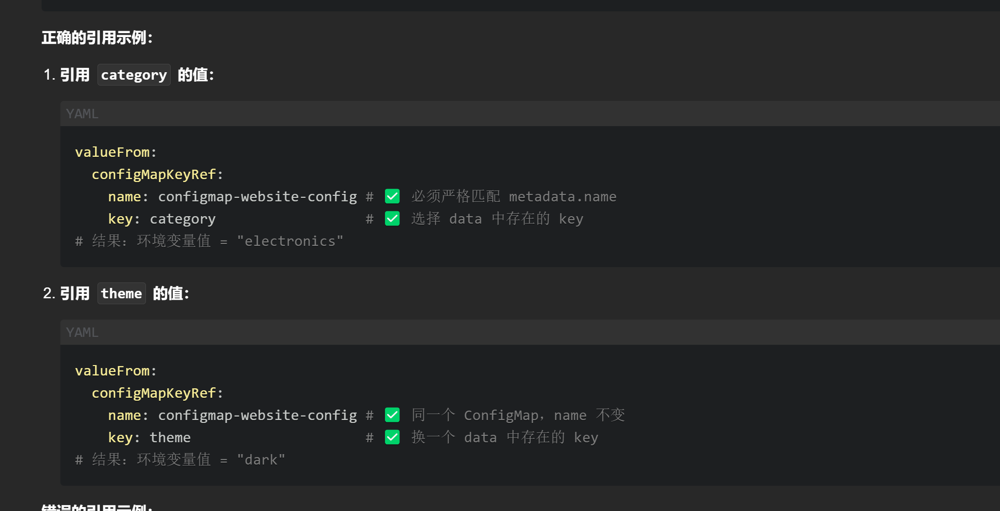

# 还是继续配置文件
```yaml
apiVersion: apps/v1
kind: Deployment
metadata:
  name: nginx-deployment
spec:
  replicas: 3
  selector:
    matchLabels:
      app: nginx
  template:
    metadata:
      labels:
        app: nginx
    spec:
      containers:
      - name: nginx
        image: nginx:stable-alpine3.21-perl
        ports:
        - containerPort: 80
```

# `kubectl apply -f <file.yaml>` 

## `kubectl get deploy`
## `kubectl logs deploy/nginx-deployment`查看deploy里面的具体某一个deploy的日志


##  `kubectl describe deploy nginx-deployment`查看具体配置

# 当我们发现某个deploy的配置有问题，可以直接edit更新它的配置文件内容`kubectl -n application1 edit deploy api`


# 在写configmapkeyref引用的时候，key和value必须严格对应

