<h1 align="center">yaml文件中写pod的部署类型</h1>

## 目录
1. [replicaSet管理一组的pod](#1-replicaset管理一组的pod通常不直接用而是通过deployment去管理)
   - [部署步骤](#部署步骤)
   - [检查状态](#检查状态)
   - [kubectl delete replicaset删除指令](#kubectl-delete-replicaset删除指令)
2. [Service为一组 Pod 提供网络访问](#2-service为一组-pod-提供网络访问定义负载均衡或外部访问方式)
   - [常见类型：ClusterIP、NodePort、LoadBalancer](#常见类型clusterip默认nodportloadbalancer)
3. [deployment模式（常用）](#3deployment模式常用直接包含replicaset的功能)
   - [检查deployment状态](#检查下kubectl-get-deployment)
   - [实验部分](#实验部分建议先删除掉所有的pod资源再搞比较明显kubectl-delete-all---all)
4. [statefulset](#4-statefulset)


# 1. replicaSet管理一组的pod（通常不直接用，而是通过deployment去管理）
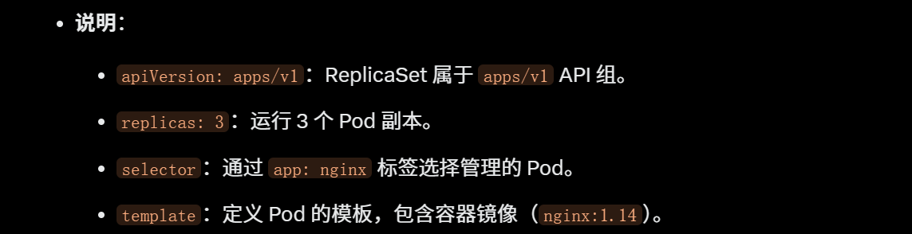
## 这里一定要注意，selector.matchLabels指定app:nginx就是下面模板的labels.app:nginx
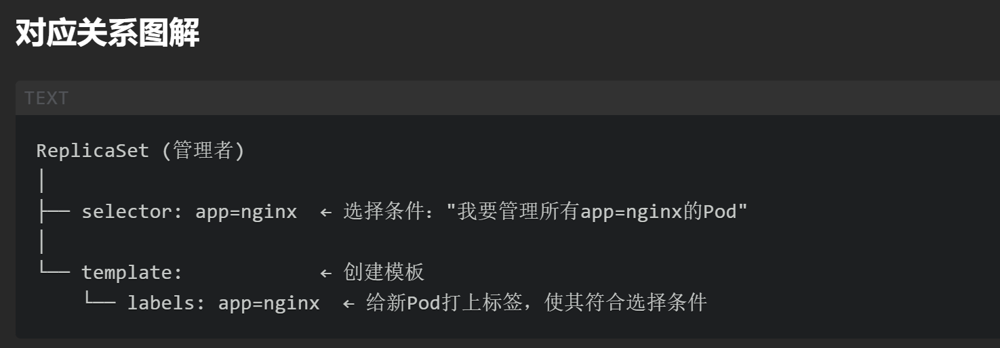
```yaml
apiVersion: apps/v1
kind: ReplicaSet
metadata:
  name: nginx-replicaset
  namespace: default
spec:
  replicas: 3
  selector:
    matchLabels:
      app: nginx
  template:
    metadata:
      labels:
        app: nginx
    spec:
      containers:
      - name: nginx
        image: nginx:1.14
        ports:
        - containerPort: 80
```
## 部署步骤
```sh
kubectl apply -f kind-replicaSet-Sample.yaml
```
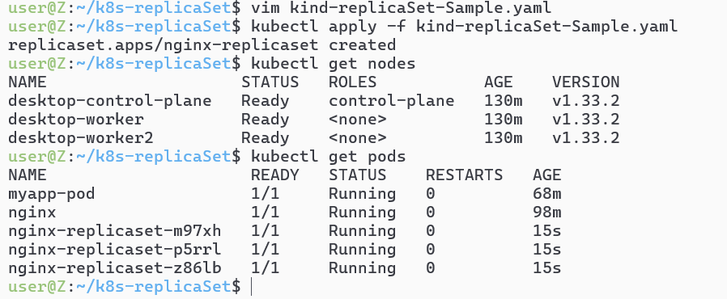
## 检查状态
```sh
 kubectl get pods -o wide
```
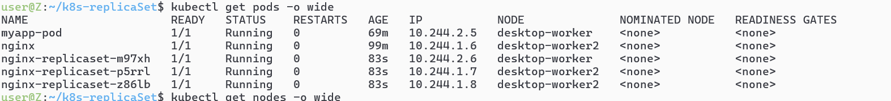
## 这里检查可以多一个`kubectl get replica`的指令
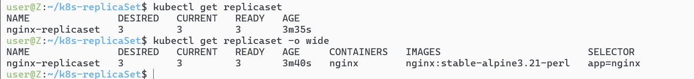
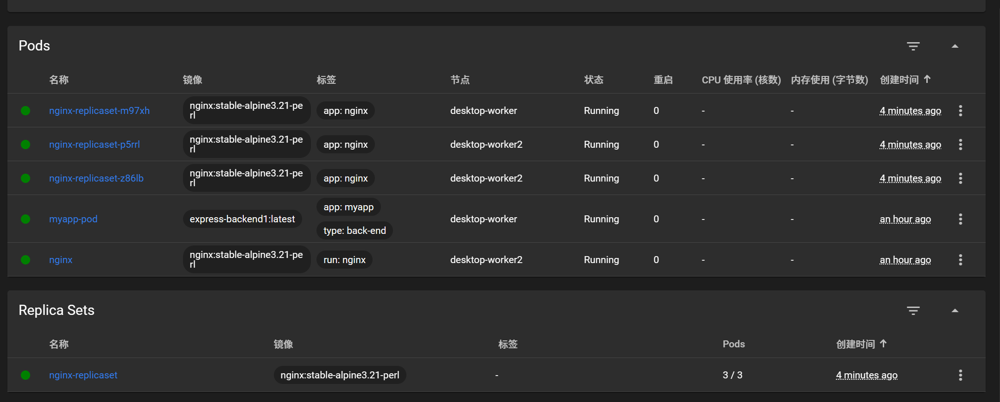
## kubectl delete replicaset删除指令
# 2. Service为一组 Pod 提供网络访问，定义负载均衡或外部访问方式。
## service匹配的就是pod的label中app:nginx的内容
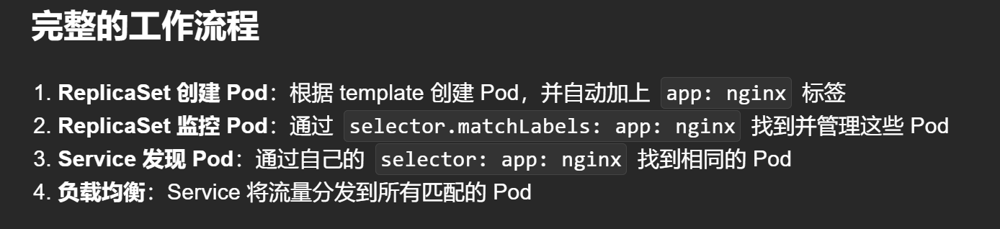
## 常见类型：ClusterIP（默认）、NodePort、LoadBalancer。
```yaml
apiVersion: v1
kind: Service
metadata:
  name: nginx-service
spec:
  selector:
    app: nginx
  ports:
  - protocol: TCP
    port: 80
    targetPort: 80
  type: NodePort
```
## 这个用kubectl get serivice去查看
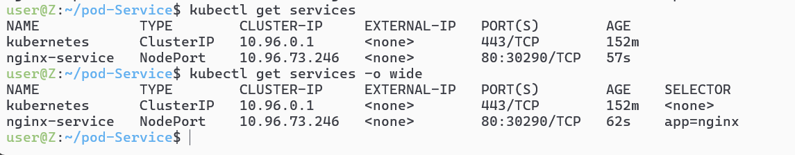
## 这里还匹配了app:nginx的pod（匹配到了3个pod）
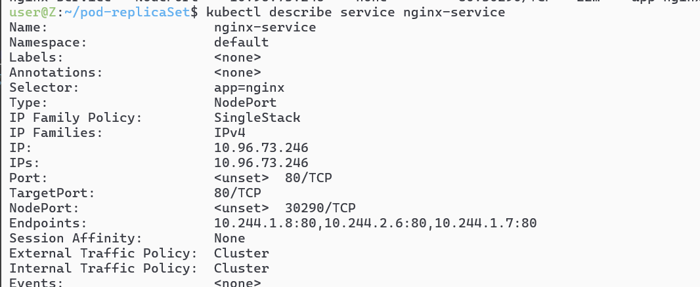

# 3.deployment模式（常用）直接包含replicaSet的功能
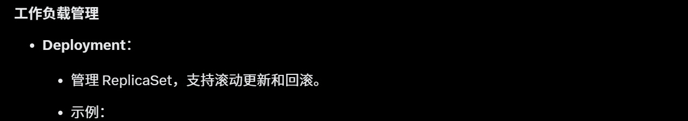


## 检查下`kubectl get deployment`
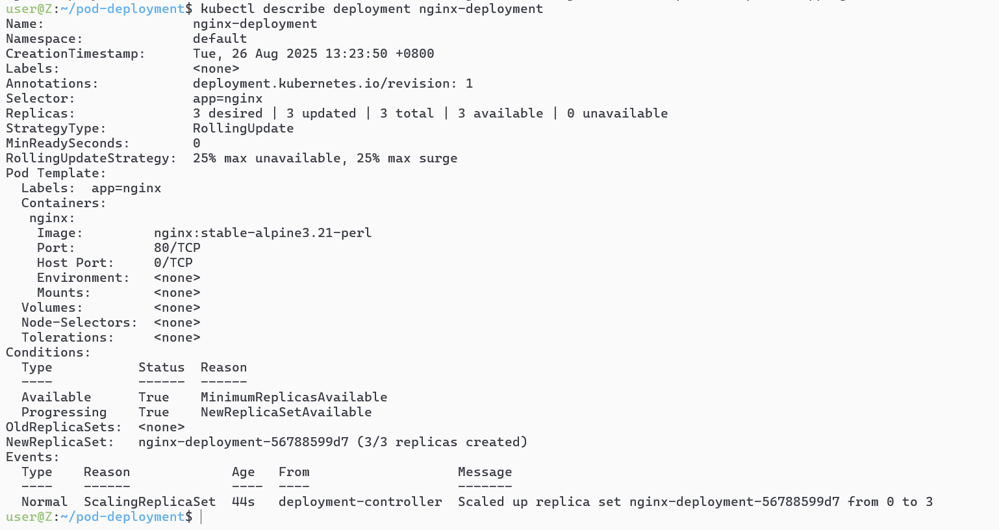
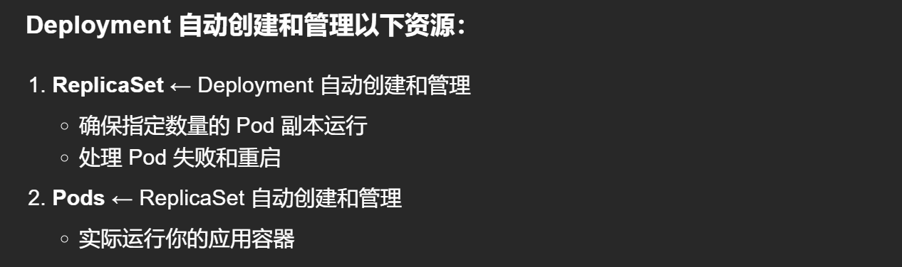
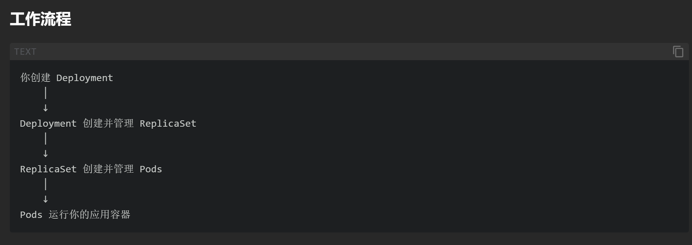

## 实验部分建议先删除掉所有的pod资源再搞，比较明显`kubectl delete all --all`
## 然后再创建
```yaml
apiVersion: apps/v1
kind: Deployment
metadata:
  name: nginx-deployment
spec:
  replicas: 3
  selector:
    matchLabels:
      app: nginx
  template:
    metadata:
      labels:
        app: nginx
    spec:
      containers:
      - name: nginx
        image: nginx:stable-alpine3.21-perl
        ports:
        - containerPort: 80
```
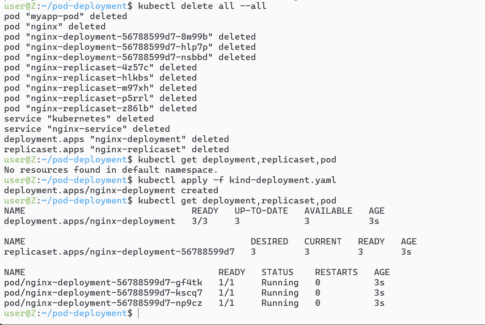

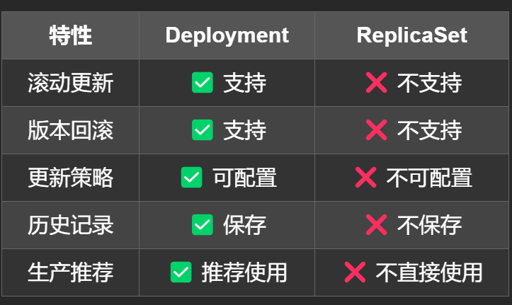

# 4-statefulset