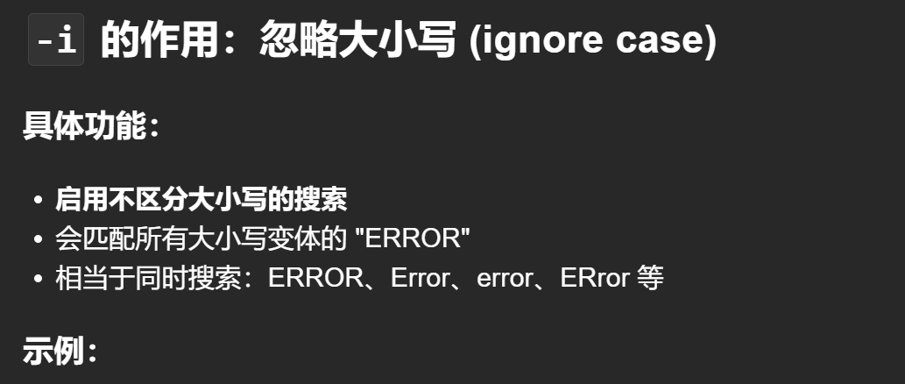

# 1. -c或者--container指定容器`kubectl  logs deploy/collect-data -c nginx >> /root/logs.log`


## 当然不仅仅是deploy，其他的pod也可以`kubectl logs pod/nginx-687f78cc87-g4zbr -c nginx`

## 打印日志到某个文件，记住`>>`是追加（即使没有文件，也能创建文件），而`>` 是覆盖
```sh
kubectl -n management logs deploy/collect-data -c nginx >> /root/logs.log
```
## `kubectl logs alpine-reader-pod > podlogs.txt`


# `kubectl logs application-pod | grep -i "ERROR" > poderrorlogs.txt` -i忽略大小写
