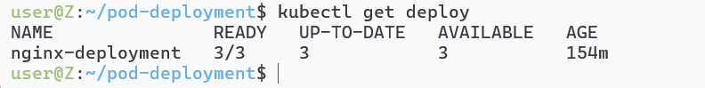
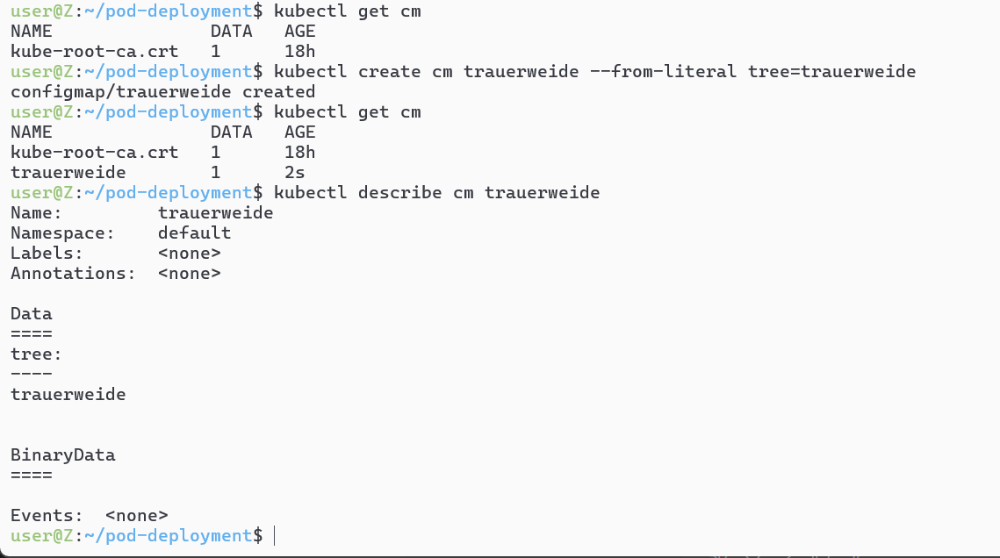
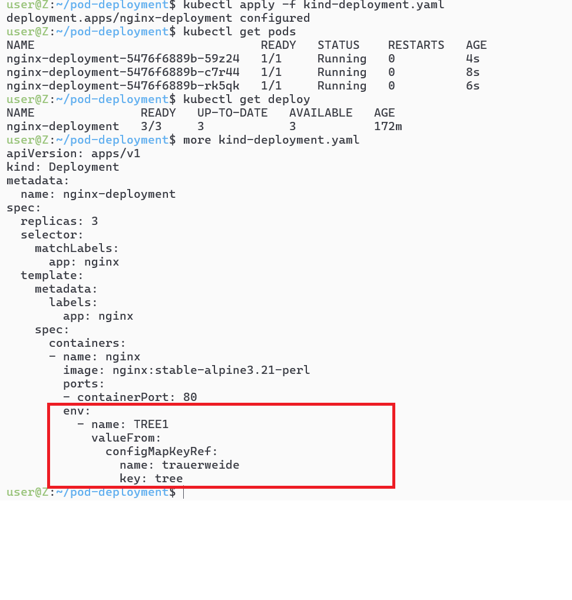

# 初始文件
```yaml
apiVersion: apps/v1
kind: Deployment
metadata:
  name: nginx-deployment
spec:
  replicas: 3
  selector:
    matchLabels:
      app: nginx
  template:
    metadata:
      labels:
        app: nginx
    spec:
      containers:
      - name: nginx
        image: nginx:stable-alpine3.21-perl
        ports:
        - containerPort: 80
```

# kubectl apply -f <文件名>
# kubectl get deploy查看情况


# 随后试图导入环境变量，主要是研究valueFrom中的cm(configmapref)里面的数据来源
## 但是我们当前的环境没有可用的CM，所以要创建一个，创建的办法可以通过 _[创建cm](./7-kubectl%20get%20cm指令.md/#通过apply的方式创建cm)_

# 下一步在我们的yaml文件中引用这个cm

