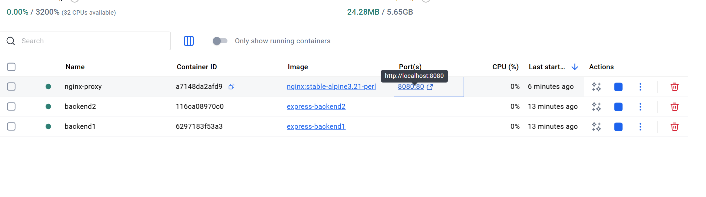
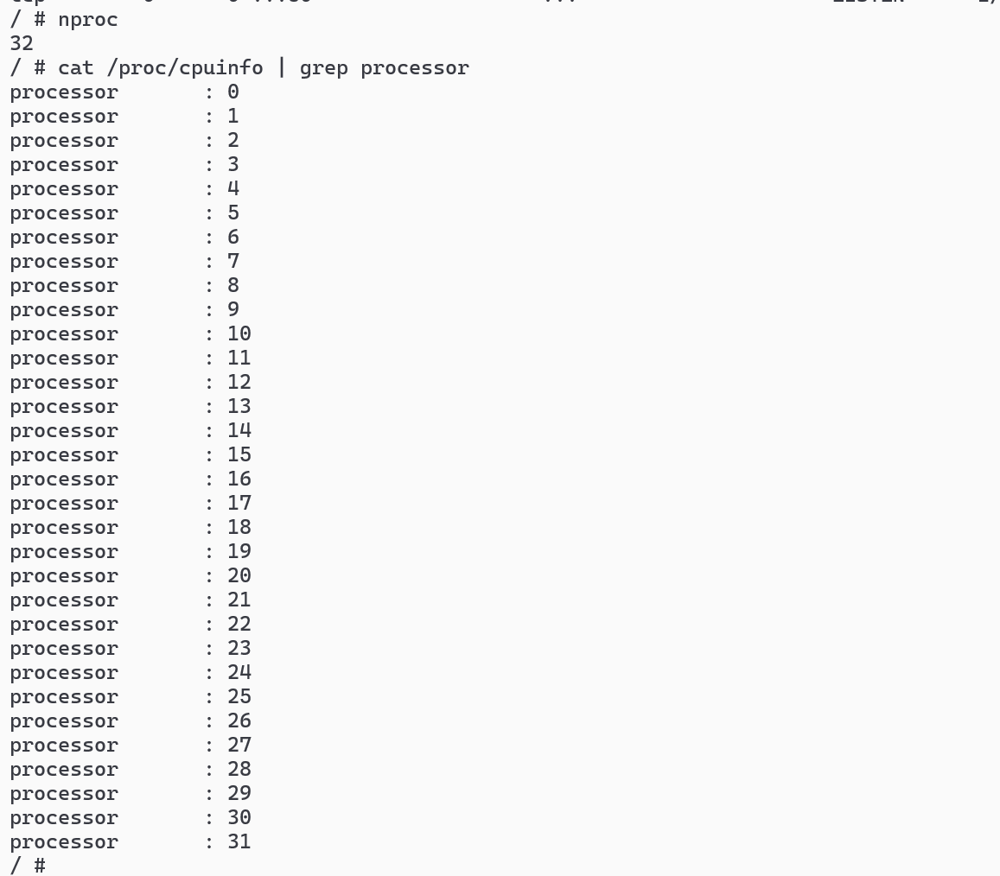

## [源文件](./源nginx.conf)


# 确认下我们的容器情况

# 进我们的nginx-proxy容器中，先查看cpu核数
# 指令 `nproc`或者`cat /proc/cpuinfo | grep processor`



# 调整/etc/nginx/nginx.conf文件中
# 示例配置
```sh
worker_processes auto; # 自动检测 CPU 核心数
events {
    worker_connections 1024; # 每个 worker 最大连接数
    use epoll; # Linux 下使用 epoll
    multi_accept on; # 允许 worker 一次性接受多个连接
}
```


# nginx -t检查语法

# nginx -s reload应用更改(不会导致断网)
