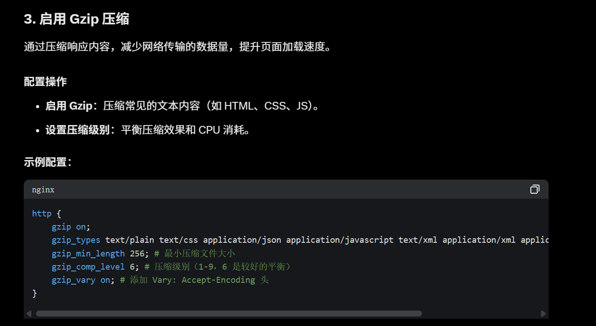
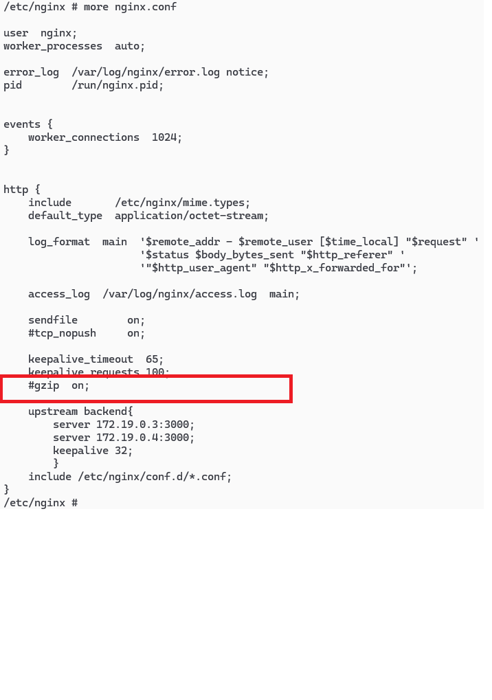

# 就在nginx.conf的http块中

# 可以按照给的建议改良
```sh
http {
    gzip on;
    gzip_types text/plain text/css application/json application/javascript text/xml application/xml application/xml+rss text/javascript;
    gzip_min_length 256; # 最小压缩文件大小
    gzip_comp_level 6; # 压缩级别（1-9，6 是较好的平衡）
    gzip_vary on; # 添加 Vary: Accept-Encoding 头
}
```