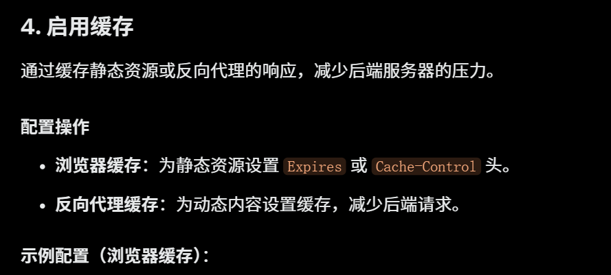
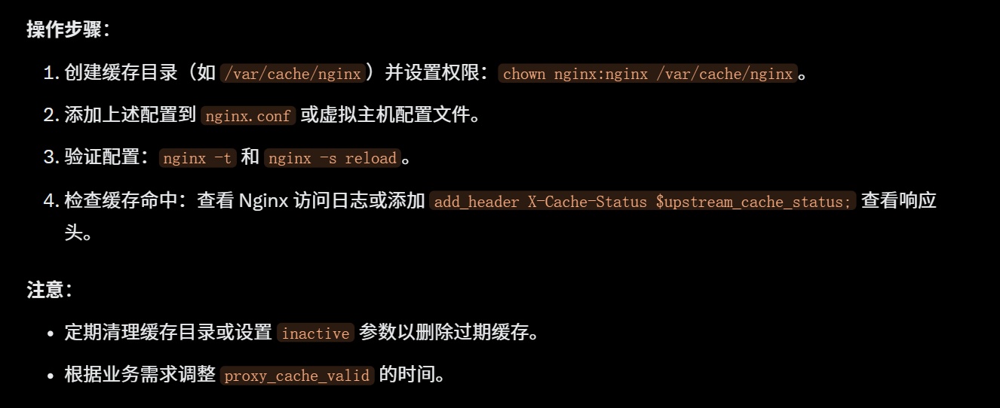

```sh
server {
    location ~* \.(jpg|jpeg|png|gif|ico|css|js|woff2?|ttf|svg|eot|otf)$ {
        expires 1y; # 缓存 1 年
        add_header Cache-Control "public, immutable";
    }
}
```
# 反向代理缓存
```sh
http {
    proxy_cache_path /var/cache/nginx levels=1:2 keys_zone=my_cache:10m max_size=10g inactive=60m use_temp_path=off;

    server {
        location / {
            proxy_cache my_cache;
            proxy_cache_valid 200 302 1h; # 缓存 200 和 302 状态 1 小时
            proxy_cache_valid 404 10m; # 缓存 404 状态 10 分钟
            proxy_pass http://backend;
        }
    }
}
```
