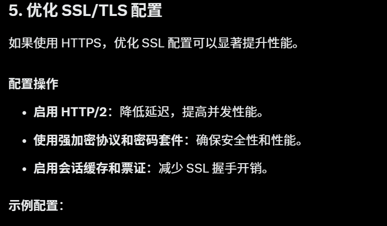

```sh
server {
    listen 443 ssl http2;
    ssl_certificate /etc/nginx/ssl/your_domain.crt;
    ssl_certificate_key /etc/nginx/ssl/your_domain.key;
    ssl_protocols TLSv1.2 TLSv1.3;
    ssl_ciphers EECDH+AESGCM:EDH+AESGCM:AES256+EECDH:AES256+EDH;
    ssl_prefer_server_ciphers on;
    ssl_session_cache shared:SSL:10m;
    ssl_session_timeout 1d;
    ssl_session_tickets on;
}
```
