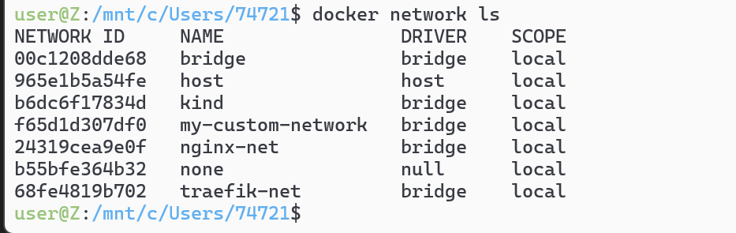
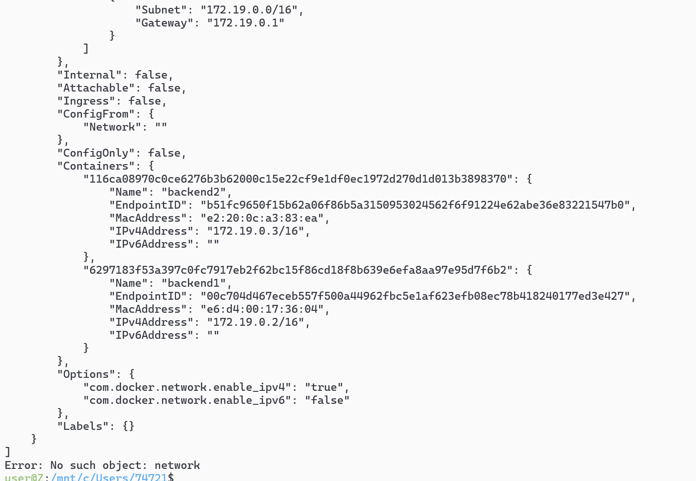
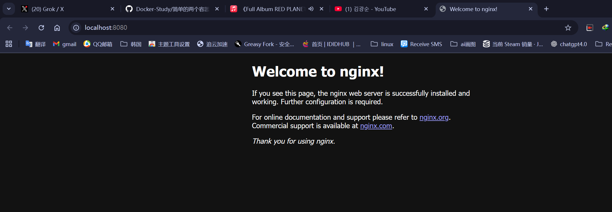

# 实验环境搭建
# 第一步，创建 nginx 网络

```sh
docker network create nginx-net
```


# 写后端和dockerfile

```sh
docker build -t express-backend1 .
docker build -t express-backend2 .
docker run -d --name backend1 --network nginx-net express-backend1
docker run -d --name backend2 --network nginx-net express-backend2
```

# 查看结果`docker inspect network nginx-net`



# 根据nginx:stable-alpine3.21-perl创建容器
```sh
docker run -d \
  --name nginx-proxy \
  --network nginx-net \
  -p 8080:80 \
  nginx:stable-alpine3.21-perl
```

# 看见了nginx服务
