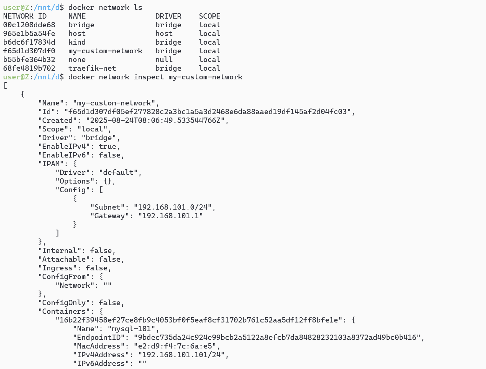
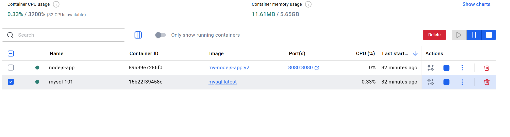
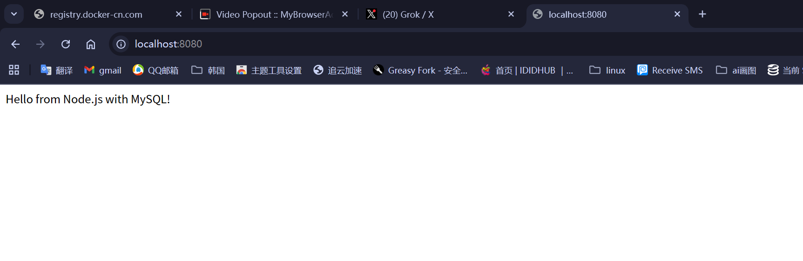
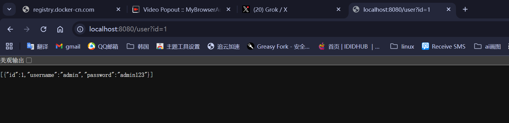
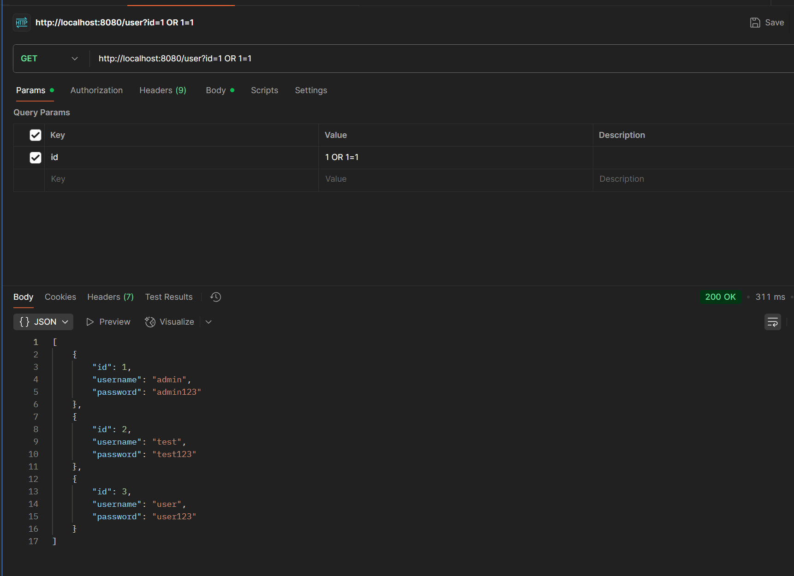

# 此项目是模拟 sql 注入的场景

# 只需要环境是 docker 就行

# 创建网络（如果不需要指定网关，可以省略 --gateway）

```sh
docker network create --subnet=192.168.101.0/24 --gateway=192.168.101.1 my-custom-network
```

# 查看网络详情（包括该网络下的容器信息）

```sh
docker network inspect my-custom-network
```



# 创建 mysql 的容器后端，并指定密码是`123456`,持久化了数据库

```sh
docker run -d --name mysql-101 --network my-custom-network --ip 192.168.101.101 -v mysql-data:/var/lib/mysql  -e MYSQL_ROOT_PASSWORD=123456 mysql:latest
```

# 随后将后端代码 node 部署了

<h2 style="color: red">dockerfile</h2>

```dockerfile
# 使用 Node.js 官方镜像作为基础镜像
FROM node:22-alpine

# 设置工作目录
WORKDIR /usr/src/app

# 复制 package.json 和 package-lock.json (如果存在)
COPY package*.json ./

# 安装依赖
RUN npm install

# 复制应用程序代码
COPY . .

# 暴露应用程序端口
EXPOSE 8080

# 启动应用
CMD ["node", "app.js"]

```

<details>
<summary style="color:red;font-size: 18px"> app.js</summary>

```js
const express = require("express");
const mysql = require("mysql2");
const app = express();

const connection = mysql.createConnection({
  host: "192.168.101.101", // MySQL 容器的固定 IP
  user: "root",
  password: "123456", // 与 MYSQL_ROOT_PASSWORD 一致
  database: "mydb", // 需提前创建数据库
});

// 连接到数据库
connection.connect((err) => {
  if (err) {
    console.error("数据库连接失败:", err);
    return;
  }
  console.log("成功连接到MySQL数据库");

  // 创建password表（如果不存在）
  const createTableSQL = `
        CREATE TABLE IF NOT EXISTS password (
            id INT AUTO_INCREMENT PRIMARY KEY,
            username VARCHAR(255) NOT NULL,
            password VARCHAR(255) NOT NULL
        )
    `;

  connection.query(createTableSQL, (err) => {
    if (err) {
      console.error("创建表失败:", err);
      return;
    }
    console.log("password表创建成功或已存在");

    // 插入一些测试数据
    const testData = [
      { username: "admin", password: "admin123" },
      { username: "test", password: "test123" },
      { username: "user", password: "user123" },
    ];

    connection.query(
      "INSERT IGNORE INTO password (username, password) VALUES ?",
      [testData.map((item) => [item.username, item.password])],
      (err) => {
        if (err) {
          console.error("插入测试数据失败:", err);
          return;
        }
        console.log("测试数据插入成功");
      }
    );
  });
});

// 有意的SQL注入漏洞路由
app.get("/user", (req, res) => {
  const id = req.query.id;
  // 故意不使用参数化查询，造成SQL注入漏洞
  const query = `SELECT * FROM password WHERE id = ${id}`;

  connection.query(query, (err, results) => {
    if (err) {
      res.status(500).json({ error: "查询失败" });
      return;
    }
    res.json(results);
  });
});
app.get("/", (req, res) => res.send("Hello from Node.js with MySQL!"));
app.listen(8080, () => console.log("Server running on port 8080"));
```

</details>

# 然后执行 dockerfile

```sh
docker build -t my-nodejs-app .

docker run -d --name nodejs-app --network my-custom-network -p 8080:8080 my-nodejs-app
```



# 访问本地网页 localhost:8080



# 访问数据库



# sql 注入


