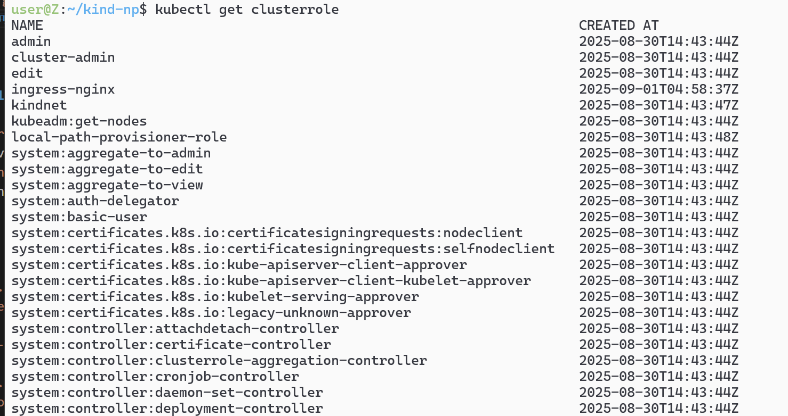
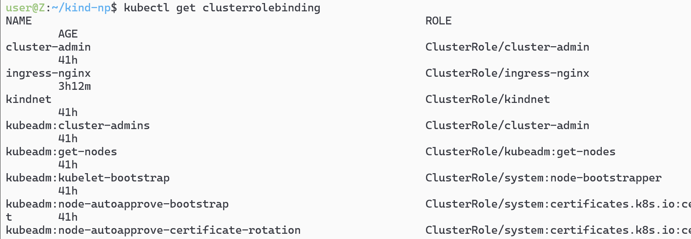
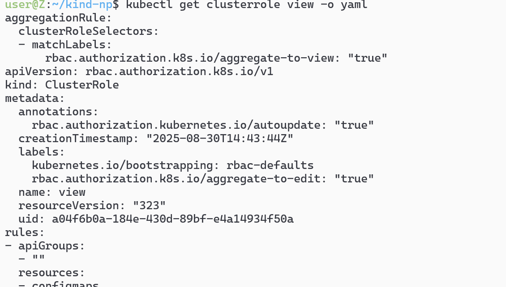

<h1 align="center">角色权限管理</h1>

# 1-通过`kubectl get clusterrolebinding` 和` kubectl get clusterrole`可以看集群预制的权限情况



# 2- 通过`kubectl get clusterrole view -o yaml`可以看具体的权限配置

# 3- 
# 命令行
## kubectl get clusterrole可以看预制的权限
```sh
k create clusterrolebinding pipeline-view \
  --clusterrole view \                    # 权限角色
  --serviceaccount ns1:pipeline \         # 绑定的 SA
  --serviceaccount ns2:pipeline           # 另一个绑定的 SA

```
```yaml
apiVersion: rbac.authorization.k8s.io/v1
kind: ClusterRoleBinding
metadata:
  name: pipeline-view
roleRef:
  apiGroup: rbac.authorization.k8s.io
  kind: ClusterRole
  name: view                      # 引用 view ClusterRole
subjects:
- kind: ServiceAccount
  name: pipeline
  namespace: ns1                  # ns1 中的 pipeline SA
- kind: ServiceAccount
  name: pipeline  
  namespace: ns2                  # ns2 中的 pipeline SA

```